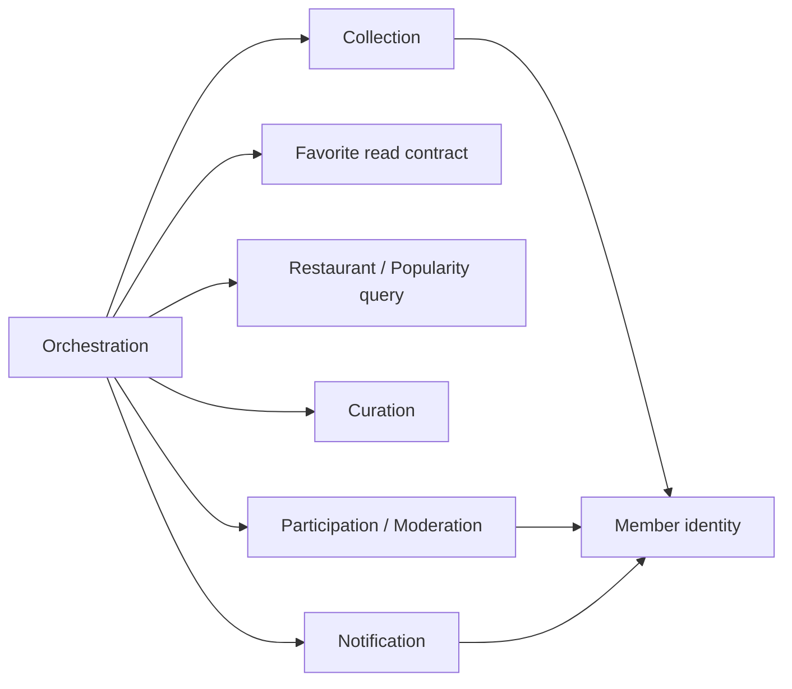

---
related_documents:
  - ../00-overview/scope.md
  - ../00-overview/glossary.md
  - ../01-requirements/functional-requirements.md
  - ../01-requirements/business-rules.md
  - domain-boundaries.md
  - first-expansion-workstreams.md
  - second-expansion-workstreams.md
  - ../06-architecture/module-boundaries.md
  - ../06-architecture/package-structure.md
---

# 맛잇온 2차 확장 도메인 경계

## 1. 목적

이 문서는 2차 확장 데이터와 규칙의 변경 책임을 정한다. 도메인 경계는 패키지·테이블·배포 단위가 아니며, 새 최상위 패키지는 후속 아키텍처 검토에서 독립 규칙과 의존 방향이 확인된 경우에만 추가한다.

## 2. 경계 결정

| 책임 | 소유 경계 | 소유 규칙·데이터 | 사용 경계 |
|---|---|---|---|
| 개인 컬렉션 | 회원 개인화 | 컬렉션 소유권, 20/100 상한, 구성 고유성, 정렬, 탈퇴 정리 | Member identity와 Restaurant 공개 판정 사용 |
| 인기 집계 | Restaurant 조회 애플리케이션의 popularity 책임 | 현재 찜 수 집계, 포함 대상, 상위 20개, 안정 정렬 | Orchestration이 Favorite 읽기와 Restaurant 공개 판정을 조합 |
| 큐레이션 | 독립 Curation 책임 | 초안·게시 상태, 제목·설명, 구성 20개, 수동 순서, 메인 노출 | Admin principal과 Restaurant 공개 판정 사용 |
| 제보·신고 | Participation 안의 Moderation 책임 | 요청 유형, 중복·일일 제한, 상태 전이, 사유, 보존, 감사 이력 | Member/Admin identity와 대상 도메인 명령 사용 |
| 사용자 알림 | 독립 Notification 책임 | 알림 고유성, 소유권, 읽음, 미읽음 수, 보존 | Participation 상태 전이 사건을 같은 트랜잭션에서 사용 |
| 교차 조회·명령 | Orchestration 애플리케이션 책임 | 유스케이스 순서, 권한 전달, 여러 경계 결과 조합 | 비즈니스 규칙과 원본 상태를 소유하지 않음 |

## 3. 핵심 경계 규칙

### 3.1 개인 컬렉션과 큐레이션

- 두 기능은 “맛집 목록”이라는 표현만 공유한다.
- 개인 컬렉션은 회원 소유·비공개·탈퇴 생명주기를, 큐레이션은 관리자 편집·게시·공개 노출 생명주기를 가진다.
- Aggregate, 저장소와 상태 모델 공유를 전제로 하지 않는다.
- Restaurant는 맛집 원본과 공개 판정만 제공하며 두 목록의 순서·상한을 소유하지 않는다.

### 3.2 인기 집계

- Favorite는 회원별 찜의 추가·해제와 고유성을 계속 소유한다.
- Popularity 조회 유스케이스는 Favorite 원본을 변경하지 않고 Favorite 읽기 계약과 Restaurant 공개 판정을 orchestration에서 조합한다.
- 이번 범위는 실시간 PostgreSQL 조회이므로 별도 집계 Aggregate, 배치 도메인과 재계산 상태를 만들지 않는다.
- 성능 요구가 현재 계약으로 충족되지 않을 때만 캐시·집계 모델을 ADR에서 검토한다.

### 3.3 제보·신고와 원본 데이터

- Participation은 요청과 검토 상태를 소유하지만 Restaurant·Creator·Video·Visit 원본을 직접 소유하지 않는다.
- `ACCEPTED`는 요청 승인일 뿐 원본 데이터 변경 완료가 아니다.
- 실제 등록·정정·수동 숨김은 대상 도메인의 기존 명령을 orchestration이 호출하고 성공을 확인한 뒤 `COMPLETED`로 전이한다.
- 신고 접수 또는 승인만으로 공개 상태를 자동 변경하지 않는다.

### 3.4 알림과 처리 상태

- Participation은 허용된 상태 전이와 전이 사유를 소유한다.
- Notification은 생성된 알림, 읽음과 보존을 소유한다.
- 상태 전이와 알림 생성의 원자성은 orchestration 유스케이스가 보장하되, 두 경계의 내부 규칙을 복제하지 않는다.
- 메시지 브로커·outbox·푸시 채널은 현재 범위가 아니므로 이를 위한 최상위 경계를 미리 만들지 않는다.

## 4. 의존 방향

- 도메인끼리 양방향 호출하지 않는다. 교차 흐름은 orchestration에서 조합한다.
- 조회 편의를 위해 다른 도메인의 엔티티를 직접 참조·변경하지 않고 식별자와 공개된 계약을 사용한다.
- Collection·Curation·Participation은 Restaurant 엔티티를 직접 변경하지 않는다. Restaurant 공개 판정과 대상 명령은 orchestration이 조합한다.
- Curation과 Collection 사이에는 직접 의존이 없다.

## 5. 패키지 결정 게이트

| 후보 | 현재 판단 | 후속 승인 조건 |
|---|---|---|
| `collection` 최상위 패키지 | 보류 | 기존 회원 개인화 내부에서 규칙 응집이 깨지거나 독립 Port가 필요함을 설계로 입증 |
| `popularity` 최상위 패키지 | 추가하지 않음 | 배치·스냅샷·재계산 생명주기가 범위에 들어와 독립 모델이 필요할 때 재검토 |
| `curation` 최상위 패키지 | 후보 | 게시 생명주기와 관리자 순서 규칙을 기존 경계에 넣을 수 없음을 모듈 설계에서 확인 |
| `participation` 또는 `moderation` | 후보 | 제보·신고 공통 상태와 감사 정책의 응집도 및 대상 도메인 의존 방향 검증 |
| `notification` 최상위 패키지 | 후보 | 읽음·보존·고유성 규칙을 독립 모듈로 검증하고 순환 의존이 없음을 확인 |
| `orchestration` | 기존 애플리케이션 책임 재사용 | 새 비즈니스 엔티티나 원본 규칙을 두지 않음 |

후속 [모듈 경계](../06-architecture/module-boundaries.md)와 [패키지 구조](../06-architecture/package-structure.md)가 실제 코드 위치를 확정한다. 이 문서만을 근거로 빈 최상위 패키지를 만들지 않는다.

## 6. 결정 결과

- 개인 컬렉션과 큐레이션은 별도 Aggregate다.
- 인기 집계는 현재 Restaurant 공개 조회 책임에 붙는 읽기 책임이며 별도 Aggregate가 아니다.
- 제보와 신고는 별도 요청 유형·API를 유지하되 Participation/Moderation 경계에서 공통 처리 정책을 공유한다.
- Notification은 처리 요청 원본을 소유하지 않는다.
- Orchestration은 교차 유스케이스만 소유하고 새 비즈니스 도메인으로 취급하지 않는다.
