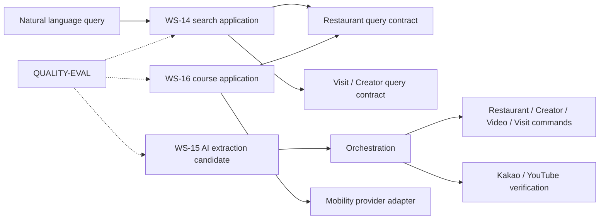

# 맛잇온 3차 확장 도메인 경계

## 1. 목적과 결정 상태

이 문서는 3차 확장 기능을 기존 Restaurant·Creator·Video·Visit 경계에 어떻게 연결할지와 새 후보·작업 상태의 소유 책임을 정한다. 2026-08-10 팀 결정으로 경계와 소유 책임을 승인했다. 구현은 이 문서와 연결된 요구사항·API·데이터·ADR 계약을 함께 따른다.

도메인 경계는 화면, API URL, 테이블 또는 배포 단위가 아니다. 같은 변경 이유와 업무 규칙을 가진 책임을 묶고, 여러 경계의 조회·명령 조합은 orchestration 애플리케이션 책임으로 둔다.

현재 결정의 성격은 다음과 같다.

- **경계 제안**: 기존 도메인의 책임 확장과 3차 후보·작업 경계를 정의한다.
- **선확정 기준**: n8n·외부 Queue를 도입하지 않고 애플리케이션 내부 Worker를 사용하며, 관리자 검수 전 AI 결과는 정식 Entity가 아니고 원문·자막 전체와 코스 결과는 초기 저장하지 않는다.
- **확정 기준**: 후보 Snapshot의 논리 Schema, 자연어 P1 사전·규칙, Worker 실행 수치, 경로 순서·TTL·호출 상한과 API 필드는 연결된 ADR·데이터·API 계약을 따른다. 실제 외부 계정·quota 연결과 단일 EC2 부하 증거만 운영 검증 게이트로 남긴다.

`confirmed`는 경계·제공자·모델·운영 수치의 정책 결정을 마친 상태를 뜻한다. 물리 테이블과 구현 세부는 연결된 데이터·API 계약의 승인 상태를 기준으로 한다.

## 2.1. 2026-08-10 선확정 결정

| 결정 | 확정 기준 | 아직 남은 항목 |
|---|---|---|
| AI 실행 방식 | n8n·외부 Queue·Spring Batch를 도입하지 않고 애플리케이션 내부 Worker로 시작한다. 인스턴스당 1개 Worker, polling 5초, lease 120초, heartbeat 30초를 사용한다. | 단일 EC2의 실제 처리량은 최종 부하 증거로 검증 |
| 영상 유입 | 활성화된 채널의 Webhook과 관리자 신규 영상 추가를 동일 작업 경계로 수렴 | Webhook 구독 갱신·보정 조회 주기·자동 추출 입력 텍스트 계약 |
| AI 제공자 결합 | Provider Port/Adapter 뒤에 Google Gemini API Free Tier의 Gemini Developer API global endpoint와 `gemini-3-flash-preview`를 연결한다. Prompt `P1`, 결과 Schema `S1`, 유료 호출 0원·무료 quota hard stop을 적용한다. | 운영 계정의 실제 billing 미연결·quota 연결 확인 |
| AI 데이터 | 후보 Snapshot·검수 이력과 정식 Entity·확정 VisitTag를 분리하고 검수·외부 검증 후에만 저장한다. 허용 태그 18종과 `TIMESTAMP`·`TEXT_RANGE`·`UNKNOWN` 근거 유형을 사용한다. | 실제 마이그레이션 적용 증거 |
| 원문 보존 | 원본 영상·전체 자막·전체 모델 응답을 저장하지 않고 근거 위치·해시만 관리자 전용으로 보존 | 실제 Google 계정 데이터 처리 설정 확인 |
| 자연어 검색 | P1 규칙 기반 해석만 사용하며 LLM·임베딩·RAG·챗봇을 도입하지 않는다. 지원 태그 18종, 태그 AND, 별칭 모호성 `UNRESOLVED`를 적용한다. | 운영 전 평가 Dataset 실행 증거 |
| 코스 결과 | Kakao Mobility 자동차 길찾기 `/v1/directions`를 1회 호출하고 첫 장소 출발·최근접 이웃 순서·동률 Restaurant ID 오름차순·TTL 5분·캐시 없음·앱 월 1,000건 상한을 적용한다. | 운영 계정의 실제 quota 연결 확인 |

## 2. 경계 결정 요약

| 책임 | 제안 소유 경계 | 소유하는 규칙·데이터 | 소유하지 않는 것 | 상태 |
|---|---|---|---|---|
| 기존 맛집 기본 정보·공개 상태·좌표 | Restaurant | 맛집 동일성, 공개 생명주기, Kakao 장소 식별, 좌표의 등록·보강 상태 | 자연어 요청, 코스 순서, AI 후보 | 기존 경계 유지 |
| 자연어 조건 해석 | WS-14의 탐색 애플리케이션 책임 | P1 규칙·사전 기반 해석, 지원 조건·확정 태그 정규화, 직접 필터 우선, 해석 실패 | Restaurant 데이터, LLM·임베딩 색인, 검색 결과의 새 순위, 미확정 태그 | 새 검색 영속 도메인 없음, TagDefinition·VisitTag 조회 계약 재사용 |
| AI 추출 작업·후보·검수 | 독립 AI Extraction 후보 경계 | 작업 상태, 중복 수렴, 후보 Snapshot·태그 후보, 근거·신뢰도, 검수 상태, 모델·Prompt·Schema 버전 | 공개 Restaurant·Creator·Video·Visit·VisitTag의 정식 생성·변경 | 새 운영 경계 후보 |
| YouTube·Kakao 검증과 정식 등록 | 기존 Creator·Video·Restaurant·Visit + orchestration | 각 정식 Entity의 기존 검증·공개 규칙, 검증 순서와 원자적 연결 | AI 후보의 사실 확정 | 기존 경계 재사용 |
| 코스 입력·순서·경로 결과 | WS-16의 코스 조회 애플리케이션 책임 | 2~5개 선택 검증, 자동차 순서 계산, 구간 결과, TTL·부분 실패 정책 | 맛집 선택, Restaurant 좌표, 현재 위치·이동 이력, 초기 코스 저장 | 새 영속 도메인 없음 제안 |
| 평가 Dataset·Evaluator·출시 게이트 | QUALITY-EVAL 교차 품질 트랙 | 골든 데이터, 평가기, 버전 비교, Critical 실패, 2차 부하 승계 증거 | 기능 구현 결과의 단독 승인, 제품 범위·비용의 단독 변경 | 교차 트랙 유지 |

핵심 판단은 세 가지다. 자연어 검색과 코스 추천은 요청·조회 중심의 애플리케이션 책임으로 두고 새 비즈니스 Entity를 만들지 않는다. AI 추출은 작업 재시도·검수·감사라는 독립 생명주기가 있으므로 후보·작업 경계를 별도로 둔다. AI 후보가 기존 정식 도메인을 직접 변경하는 방향은 허용하지 않는다.

## 3. 기존 도메인과 3차 확장 연결

### 3.1. Restaurant

Restaurant는 3차 확장에서도 맛집의 정식 기본 정보와 공개 상태를 소유한다.

- 맛집 이름, 주소, Kakao 장소 식별자와 좌표는 Restaurant의 정식 데이터다.
- 좌표 보강·변경은 Restaurant의 데이터 생명주기와 관리자 등록·정정 규칙을 따른다. WS-16은 좌표를 읽지만 좌표를 임의로 생성하거나 수정하지 않는다.
- 공개·활성 상태가 아닌 맛집은 자연어 검색 결과와 코스 후보에서 제외한다.
- 자연어 조건은 Restaurant가 제공하는 이름·지역·카테고리 조회 계약으로 정규화한다.
- 코스 결과에서 사용할 좌표의 정확도·출처·보강 상태는 Restaurant 데이터 계약에서 확인한다.

### 3.2. Creator·Video·Visit

- Creator는 YouTube 채널의 정식 식별과 공개 상태를 소유한다.
- Video는 YouTube 영상의 정식 식별자·링크·메타데이터와 공개 상태를 소유한다.
- Visit는 실제 방문 근거, 맛집·유튜버·영상의 정식 관계와 관계 공개 상태를 소유한다.
- 자연어 유튜버 조건은 Creator의 선택 정보와 Visit의 유효 방문 관계를 조합해 처리한다.
- AI 후보가 추출한 채널·영상·방문 정보는 제안값일 뿐이며 Creator·Video·Visit의 정식 값으로 취급하지 않는다.
- 활성화된 채널의 Webhook과 관리자 신규 영상 추가는 모두 AI 후보 경계에 작업을 접수하며, Webhook 수신기는 정식 도메인을 직접 변경하지 않는다.
- 정식 등록은 관리자 확인, Kakao 장소 검증, YouTube 메타데이터 검증과 Visit 근거 검증을 기존 등록 흐름으로 수행한다.

### 3.3. Orchestration

Orchestration은 여러 도메인의 공개 조회와 정식 등록 순서를 조합한다. Restaurant·Creator·Video·Visit 내부 규칙이나 AI 후보의 상태를 복제하지 않는다.

- WS-14의 해석 조건을 Restaurant·Creator·Visit 조회 계약으로 전달한다.
- WS-15의 승인 후보를 기존 등록 명령과 외부 검증 순서에 전달하고, 모든 검증 성공 이후에만 정식 저장을 완료한다.
- WS-16의 공개 맛집·좌표 조건을 검증하고 Route Provider를 호출한 뒤 코스 응답을 조합한다.
- 외부 호출 중 정식 Entity 저장 트랜잭션을 열지 않으며, 외부 검증 실패 시 정식 저장은 0건이어야 한다.

## 4. 자연어 검색 경계

### 4.1. 소유 책임

자연어 검색은 WS-14가 소유하는 조회 애플리케이션 책임이다. 입력 문장을 구조화 조건으로 바꾸는 해석 결과는 요청 처리 중간 산출물이며, 초기에는 사용자 검색 원문·해석 결과를 영속 도메인으로 저장하지 않는다.

WS-14가 소유하는 정책은 다음과 같다.

- 맛집 이름·서울 자치구·음식 카테고리·유튜버의 지원 조건과 정규화
- 활성 `TagDefinition` 별칭과 확정 `VisitTag`의 코드 정규화, 여러 태그 AND 조합
- 자연어 조건과 직접 지정 필터가 충돌할 때 직접 지정 필터 우선
- 해석할 수 없는 문장, 미지원 조건, 낮은 확신 또는 후보 충돌의 분리
- 실제 조회에 적용한 조건 요약과 기존 목록 결과의 연결
- 입력 원문과 비밀정보를 로그·평가 결과에 남기지 않는 운영 계측

### 4.2. 경계 규칙

- WS-14는 Restaurant·Creator·Visit의 Entity나 Repository를 직접 변경하지 않는다.
- 임베딩 색인, RAG 문서 저장소, 챗봇 대화 메모리와 추천 순위 모델은 초기 경계에 포함하지 않는다.
- 검색 조건 해석 실패를 전체 맛집 목록으로 대체하지 않는다.
- 결과 설명은 자유 형식 생성 답변이 아니라 적용된 구조화 조건 요약으로 제한한다.
- 입력 해시·집계 지표가 필요하면 개인정보·저작권·보존 계약을 먼저 승인한다.
- `VisitTag`는 WS-15가 확정 Visit에 연결한 값만 조회하고, WS-14가 태그 정의나 태그 연결을 직접 변경하지 않는다.

### 4.3. 확정 운영 규칙

- 동의어는 P1 사전에 등록된 값만 사용하고, 복수 값은 같은 차원 OR·차원 간 AND로 적용한다.
- 상충 표현·별칭 모호성은 `UNRESOLVED`로 반환하고 추정하지 않는다.
- 해석 결과는 기존 목록 응답과 `RESULT/EMPTY/UNPARSED/PARTIAL_UNSUPPORTED` 상태를 사용한다.
- 낮은 확신이나 미지원 조건은 적용하지 않고 구조화된 오류·해석 요약으로만 노출한다.
- 기존 목록 API 조회를 재사용하며 자연어 원문은 저장하지 않고 입력 해시·집계 지표만 제한 보존한다.

## 5. AI 추출 후보 경계

### 5.1. 독립 경계가 필요한 이유

AI 영상 정보 추출은 단순 등록 보조 입력과 다르다. 작업 요청·중복 수렴·비동기 재시도·모델 버전·관리자 검수·폐기·감사라는 별도 생명주기를 가진다. 따라서 이 경계는 정식 Restaurant·Creator·Video·Visit의 대체 도메인이 아니라 정식 등록 전 후보를 관리하는 운영 경계다.

### 5.2. 소유 개념

AI 후보 경계가 소유하는 개념은 다음과 같다.

- 추출 작업 요청과 작업 상태(`QUEUED`, `RUNNING`, `SUCCEEDED`, `FAILED`), 결과 완전성(`COMPLETE`, `PARTIAL`), 유입 경로(`WEBHOOK`, `ADMIN`)
- 중복 식별을 위한 YouTube 영상 식별자·입력 텍스트 해시·모델·Prompt·Schema 버전 조합
- 맛집명·메뉴·주소·방문 여부·통제 태그 후보와 필드별 신뢰도
- 입력 지문과 근거(`TIMESTAMP`: `startMs`·`endMs`, `TEXT_RANGE`: `startOffset`·`endOffset`·`sourceHash`, `UNKNOWN`: 위치 없음)
- 후보 Snapshot과 생성 시각·모델 버전·재처리 버전
- 관리자 검수 상태·확정·보완 요청·폐기·검증 충돌 사유
- 관리자 조치의 감사 이벤트와 원자적 정식 등록 시도 결과
- 활성 태그 정의와 확정 VisitTag 연결을 위한 태그 코드·유형·근거·버전

원문 영상·전체 자막·전체 모델 응답은 이 경계의 저장 대상이 아니다. 후보에는 근거 위치와 입력 지문만 저장하고, `TEXT_RANGE`의 `sourceHash`로 원문 재저장 없이 동일 입력 여부를 판정한다. 후보와 검수 이력은 관리자 전용으로 1년 보존 후 정리한다.

### 5.3. 정식 도메인과의 변경 경계

| 행위 | AI 후보 경계 | 기존 정식 도메인 |
|---|---|---|
| AI 추출 결과 생성 | 후보 Snapshot 생성 | 변경 없음 |
| 관리자 후보 수정·보완 | 후보와 검수 이력 변경 | 변경 없음 |
| 후보 폐기 | 후보 상태·사유 변경 | 변경 없음 |
| 관리자 확정 | 정식 등록 명령 준비 | 기존 검증 시작 |
| Kakao·YouTube·Visit 검증 성공 | 작업 결과와 등록 결과 기록 | 각 Entity를 기존 규칙으로 저장 |
| 검증 실패·부분 실패 | 후보 유지 또는 보류 사유 기록 | 정식 Entity 0건 원칙 |

AI 후보 경계는 기존 Entity의 식별자와 공개 상태를 직접 수정하지 않는다. 정식 저장은 orchestration이 기존 공개 Port와 등록 명령을 사용해 수행한다.

### 5.4. 확정 운영 규칙

- 후보 작업·Snapshot·검수 이력은 연결된 데이터 계약의 상태·버전·근거 Schema를 사용하고 1년 뒤 정리한다.
- 관리자 검수는 후보별 단일 확정·폐기 상태 전이로 처리하고, 확정 전 정식 Entity와 VisitTag는 생성하지 않는다.
- Gemini는 연결 5초·응답 90초·시도 120초 timeout, 최대 2회 재시도(총 3회), backoff 5초·30초를 사용하며 정책·입력·Schema 오류는 재시도하지 않는다.
- Worker는 DB lease 120초·heartbeat 30초·polling 5초로 복구하고 인스턴스당 1개로 시작한다. 단일 EC2 용량은 최종 부하 게이트에서 증명한다.
- 후보 확정 뒤 기존 등록 명령과 외부 검증이 실패하면 정식 Entity를 0건으로 유지하고 후보를 보류한다.
- 모델·Prompt·Schema 변경은 새 버전 후보와 평가를 거쳐야 하며 자동 재처리·자동 모델 전환은 하지 않는다.

## 6. 코스·경로 경계

### 6.1. 소유 책임

코스 추천은 WS-16이 소유하는 요청·조회 애플리케이션 책임이다. 초기 코스는 사용자가 고른 2~5개 맛집의 공개 정보와 좌표로 계산한 일회성 응답이며, 코스·경로·사용자 위치를 정식 비즈니스 데이터로 저장하지 않는다.

WS-16이 소유하는 정책은 다음과 같다.

- 공개·활성·좌표 보유 맛집만 후보로 허용
- 맛집 수 2~5개와 첫 선택지를 출발점으로 하는 입력 검증
- 자동차 이동 순서와 구간별 경로 결과 조합
- 총 거리 30km 상한, 외부 timeout·429·부분 실패와 재조회 정책
- 경로 결과의 생성 시각·TTL 5분과 캐시 없음 정책에 따른 만료 처리

### 6.2. 경계 규칙

- WS-16은 맛집을 자동 선택하거나 Restaurant 좌표·공개 상태를 수정하지 않는다.
- 현재 위치·도착지·이동 이력·개인 컬렉션을 입력으로 사용하지 않는다.
- Route Provider Adapter는 외부 경로 형식을 내부 코스 계약으로 변환하지만 외부 응답을 정식 Restaurant 데이터로 저장하지 않는다.
- 외부 경로 실패 시 성공하지 않은 구간을 추정해 정상 코스로 표시하지 않는다.
- 초기에는 사용자별 코스 저장·공유·추천 이력을 만들지 않는다.

### 6.3. 확정 운영 규칙

- Kakao Mobility 자동차 길찾기 `/v1/directions`와 REST API Key를 사용하며, 유료 비용은 0원·앱 월 1,000건 상한으로 차단한다.
- 첫 장소를 출발지로 고정하고 좌표 직선거리 최근접 이웃 순서로 정렬하며, 동률은 Restaurant ID 오름차순으로 안정 정렬한다.
- 결과 TTL은 5분이고 서버 캐시는 사용하지 않는다. 만료 후에는 새 요청으로 재조회한다.
- 외부 API 실패·429·timeout·좌표 누락은 거리·시간 추정 없이 실패 또는 재선택 안내로 반환한다.
- 외부 호출은 코스 1건당 최대 1회이며, 실패·quota 초과 시 기존 탐색 기능과 코스 기능을 격리한다.

## 7. 의존 방향

- 자연어·코스 애플리케이션은 기존 공개 조회 계약을 사용하고 정식 Entity를 소유하지 않는다.
- AI 후보는 orchestration을 통해서만 기존 등록 명령에 접근한다.
- 외부 Provider Adapter는 도메인 정책을 소유하지 않고 timeout·rate limit·응답 변환을 담당한다.
- QUALITY-EVAL은 각 경계의 평가 증거를 수집하지만 기능 데이터나 실행 상태를 소유하지 않는다.
- 순환 의존을 만들지 않는다. 조회 조합 때문에 양방향 협업이 필요해 보여도 공개 Port와 orchestration으로 방향을 고정한다.

## 8. 저장·변경 권한 원칙

| 데이터 또는 상태 | 정식 소유자 | 3차 확장 접근 방식 | 금지 사항 |
|---|---|---|---|
| 맛집 기본 정보·공개 상태·좌표 | Restaurant | 조회 계약, 기존 관리자 명령 | WS-14·WS-16의 직접 수정 |
| 유튜버·영상 기본 정보·공개 상태 | Creator·Video | 기존 YouTube 검증·조회 계약 | AI 후보의 자동 확정 |
| 방문 관계·방문 근거·관계 공개 | Visit | 기존 검증·등록 명령 | 후보 결과만으로 저장 |
| 자연어 입력·해석 결과 | WS-14 애플리케이션 | 요청 범위의 구조화 조건 | 원문·해석 결과의 무승인 장기 저장 |
| AI 작업·후보·검수 이력 | AI 후보 경계 | 관리자 API·비동기 Worker | 정식 Entity 직접 변경 |
| 코스·경로 응답 | WS-16 애플리케이션 | 요청 결과·승인된 캐시 | 초기 사용자별 영속 저장 |
| 평가 Dataset·Evaluator·게이트 증거 | QUALITY-EVAL | 버전 관리된 평가 자산 | 운영 원문·비밀정보의 무단 복제 |

모든 외부 호출은 정식 핵심 Entity 저장과 분리한다. 외부 검증·AI·Mobility 호출이 실패하면 기존 탐색과 수동 등록을 계속 사용할 수 있어야 하며, 부분 결과를 성공한 정식 데이터처럼 노출하지 않는다.

## 9. 패키지·테이블 결정 게이트

| 후보 | 현재 판단 | 후속 승인 조건 |
|---|---|---|
| `natural-language` 최상위 도메인 | 추가하지 않음 제안 | 해석 결과의 독립 생명주기·저장·Port가 필요하다는 설계 증거가 있을 때 재검토 |
| `course` 또는 `route` 최상위 도메인 | 추가하지 않음 제안 | 코스 저장·공유·재계산·소유권이 범위에 승인될 때 재검토 |
| AI 추출 후보 경계 | 독립 경계 승인 | 후보·작업·검수·감사 생명주기와 데이터 계약 사용 |
| `ai-extraction` 최상위 패키지 | 구현 시 적용 | 기존 관리자·orchestration과의 의존 방향 유지 |
| `candidate`·`extraction_job` 테이블 | 논리 계약·V4 migration 반영, 공통 물리 명세 동기화 대기 | Snapshot·보존·중복·동시 claim 계약 사용 |
| 코스 경로 캐시 | 3차 확장에서는 사용하지 않음 | 별도 범위 변경과 ADR-CACHE-001 필요 |
| `QUALITY-EVAL` 저장 경계 | 교차 품질 자산으로 승인 | 접근 통제·암호화·1년 보존·원문 비저장 |

실제 클래스·패키지·테이블·API 경로는 [모듈 경계](../06-architecture/module-boundaries.md), [패키지 구조](../06-architecture/package-structure.md), 후속 데이터 명세와 ADR에서 확정한다.

## 10. 결정 완료와 실행 검증

| 결정 항목 | 현재 상태 | 확정 문서 |
|---|---|---|
| 자연어 P1 규칙·사전과 오류 Schema | 결정 완료: 지원 태그 18종·AND·`UNRESOLVED`·기존 목록 API 재사용 | 자연어 해석 ADR·API 계약 |
| AI 후보 Snapshot·근거 구간·보존 | 결정 완료: P1/S1·근거 3종·원문 비저장·1년 보존 | AI 작업 ADR·데이터 명세 |
| AI 제공자·모델·Prompt·리전·비용 | 결정 완료: Gemini Free Tier 전용·유료 호출 0원·global·`gemini-3-flash-preview`·quota hard stop | AI 제공자 ADR·비용 설정 검증 |
| 비동기 Worker·claim·재기동 복구 | 결정 완료: Worker 1개/인스턴스·polling 5초·lease 120초·heartbeat 30초 | 비동기·운영 ADR |
| Kakao Mobility API·quota·TTL·캐시 | 결정 완료: `/v1/directions`·1회 호출·TTL 5분·캐시 없음·월 1,000건 | Mobility ADR·API 계약·계정 연결 검증 |
| Restaurant 좌표 보강·품질 기준 | 정책 결정 완료: 좌표 없는 맛집은 코스 제외 | 데이터 계약·운영 보강률 검증 |
| 자연어·AI 골든 Dataset 저장·접근 | 결정 완료: 합성·승인 자산, 원문 비저장, 접근 통제·1년 보존 | 평가 전략·데이터 보안 계약 |
| 2차 정상 50명·20 RPS 및 최대 200명·80 RPS | 미측정 | 3차 최종 완료 게이트 결과 |

## 11. 다음 문서화 순서

1. 승인된 경계를 기준으로 API·데이터 계약과 구현 Task를 연결한다.
2. 자연어·AI·코스 계약 테스트와 평가 Dataset을 작성한다.
3. 외부 계정·quota 연결과 2차 부하 승계 측정을 실행한다.
4. QUALITY-EVAL이 골든 Dataset·Evaluator·품질 목표 기준선을 확정하고, 영향 WS가 평가 사례를 제공한다.
5. 2차 성능 승계 측정, 단일 EC2 용량 검증과 좌표 보강률을 실행 증거로 남긴다.
6. API·데이터·ADR·평가 결과를 3차 테스트 매트릭스와 구현 Task에 연결한 뒤 구현을 시작한다.

이 문서의 현재 결론은 기존 네 핵심 도메인을 유지하고, AI 추출 후보만 독립 운영 경계 후보로 둔다는 것이다. 이 결론은 물리 구조를 자동 확정하지 않으며, 팀 승인과 후속 계약 없이는 구현 기준으로 사용하지 않는다.
