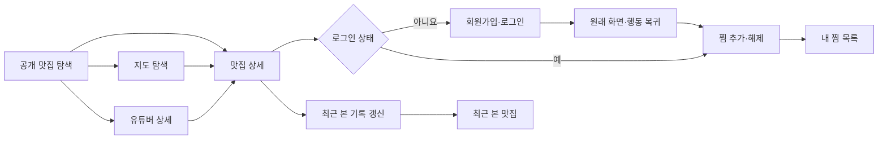

---
related_documents:
  - ../../00-overview/scope.md
  - ../../01-requirements/functional-requirements.md
  - ../../01-requirements/business-rules.md
  - ../../01-requirements/non-functional-requirements.md
  - ../prd/account/member-authentication.md
  - ../prd/personal/personal-restaurant-management.md
  - ../prd/discovery/map-discovery.md
  - ../prd/detail/creator-detail.md
  - ../wireframes/first-expansion-wireframes.md
  - ../../02-analysis/mvp-workstreams.md
---

# 1차 확장 사용자 흐름

## 1. 목적

이 문서는 1차 확장의 화면 간 이동, 사용자 선택과 시스템 상태 전이를 정의한다. 기능별 정책은 요구사항과 PRD가 소유하며, 이 문서는 여러 화면에 걸친 사용자 경험과 공통 실패 복구를 연결한다. API 경로·필드와 저장 구조는 후속 계약에서 확정한다.

## 2. 공통 원칙

- 공개 맛집 목록·상세, 지도 탐색과 유튜버 상세는 로그인 없이 사용할 수 있다.
- 찜과 최근 본 맛집은 로그인 회원에게만 제공한다.
- 인증·Redis·메일 장애가 공개 조회로 전파되지 않게 기능 경계를 분리한다.
- 인증이 필요한 행동에서 로그인하지 않았거나 인증이 만료되면 원래 목적을 잃지 않고 로그인 화면으로 안내한다.
- `401` 성격의 인증 실패는 재발급을 한 번 시도한 뒤 실패하면 로그인으로 전환한다. `403` 성격의 권한 오류는 재로그인으로 해결되는 것처럼 안내하지 않고 접근할 수 없음을 설명한다.
- 비공개·삭제 자원은 개인 목록에서 숨기며, 목록 전체가 비면 정상 빈 상태로 처리한다.
- 모든 오류 화면은 재시도 또는 안전한 공개 화면으로 이동하는 다음 행동을 제공한다.

## 3. 전체 여정

## 4. 회원가입·로그인

### UF-AUTH-001 회원가입과 이메일 인증

1. 사용자가 로그인 화면에서 회원가입을 선택한다.
2. 이메일과 정책을 만족하는 비밀번호를 입력한다.
3. 시스템은 계정 존재 여부를 드러내지 않는 동일한 접수 응답을 제공한다.
4. 사용자는 이메일의 일회용 인증 절차를 완료한다.
5. 인증이 성공하면 로그인 화면으로 이동한다.
6. 인증 Token이 만료·사용·교체됐으면 새 인증 메일 요청을 안내하되 호출 제한 상태를 함께 표시한다.

정상 완료는 인증된 계정 생성이며 자동 로그인은 포함하지 않는다. 메일 장애 때도 신규·미존재·미인증·탈퇴·활성 이메일에 같은 상태 코드·본문과 처리 시간 기준을 적용하고, 메일 발송·계정 생성 여부를 외부 응답으로 구분하지 않는다. 사용자는 동일한 이메일 확인 안내와 호출 제한 범위의 재발송 행동만 제공받고, 내부 실패는 별도 관측·재시도한다.

### UF-AUTH-002 로그인과 원래 목적 복귀

1. 사용자가 이메일과 비밀번호로 로그인한다.
2. 시스템은 계정 상태와 자격 증명을 검증하고 회원용 인증 상태를 발급한다.
3. 활성 세션이 이미 3개면 네 번째 로그인 성공과 함께 가장 오래된 세션을 폐기한다.
4. 보호된 행동에서 이동해 왔다면 해당 공개 화면으로 돌아가 찜 등 원래 행동을 다시 수행할 수 있게 한다.
5. 직접 로그인한 경우 기본 공개 탐색 화면으로 이동한다.

로그인 실패, 미존재·미인증·탈퇴 계정은 계정 상태를 구분하지 않는 응답을 사용한다. 호출 제한 중에는 남은 시간을 노출할 수 있으나 어떤 계정 상태 때문인지 드러내지 않는다.

### UF-AUTH-003 인증 만료와 Token 재발급

1. 보호된 요청에서 Access Token 만료를 감지한다.
2. 클라이언트는 같은 요청을 반복하기 전에 Refresh Token으로 재발급을 한 번 시도한다.
3. 성공하면 원래 요청을 한 번 재시도하고 현재 화면을 유지한다.
4. 만료·변조·재사용·폐기 또는 Redis 장애로 재발급하지 못하면 클라이언트 인증정보를 제거하고 로그인 화면으로 이동한다.
5. 공개 조회 화면은 계속 사용할 수 있으며 보호된 변경이 성공한 것처럼 표시하지 않는다.

### UF-AUTH-004 로그아웃·비밀번호 재설정·탈퇴

- 로그아웃은 서버 Refresh 세션 폐기가 확인된 뒤 완료한다. Redis 장애 시 클라이언트 인증정보를 제거하되 실패와 복구 후 재시도 필요를 표시한다.
- 비밀번호 재설정은 계정 존재 여부와 무관한 접수 응답을 제공한다. 새 비밀번호가 확정되면 모든 활성 세션과 남은 인증·재설정 Token을 폐기하고 다시 로그인하게 한다.
- 탈퇴 확인 뒤 즉시 로그인을 차단하고 모든 인증 상태와 개인화 데이터 정리를 시작한다. 완료 후 공개 화면으로 이동하며, 정리 실패는 15분 간격 재시도·1시간 알림·24시간 내 완료 또는 수동 복구 정책을 따른다.

## 5. 내 찜 목록

### UF-FAVORITE-001 찜 추가·해제

1. 사용자가 맛집 카드 또는 상세에서 찜 제어를 선택한다.
2. 비로그인이면 로그인 화면으로 안내하고 원래 맛집 식별자와 복귀 목적을 유지한다.
3. 로그인 회원이면 현재 상태의 반대 동작을 수행한다.
4. 중복 추가와 이미 해제된 상태의 해제는 성공한 동일 최종 상태로 처리한다.
5. 실패하면 이전 상태를 유지하고 재시도 안내를 표시한다.

### UF-FAVORITE-002 찜 목록 탐색

1. 사용자가 개인 메뉴에서 내 찜 목록을 연다.
2. 최신 찜 순으로 공개 맛집을 페이지 단위로 확인한다.
3. 항목을 선택하면 맛집 상세로 이동한다.
4. 목록에서 찜을 해제하면 해당 항목을 제거하고 페이지를 보정한다.
5. 노출 가능한 항목이 없으면 빈 상태와 공개 맛집 탐색 이동을 제공한다.

비공개 맛집의 관계는 보존하되 목록에서 숨기고, 삭제 맛집의 관계는 제거한다.

## 6. 최근 본 맛집

### UF-RECENT-001 기록 생성과 갱신

1. 로그인 회원이 공개 맛집 상세를 정상 조회한다.
2. 처음 본 맛집이면 기록을 생성하고, 다시 본 맛집이면 마지막 조회 시각만 갱신한다.
3. 비로그인, 실패한 상세 조회, 비공개·삭제 상세에는 기록을 만들지 않는다.
4. 최신 50개를 초과하거나 마지막 조회 뒤 30일이 지난 기록은 정리한다.

최근 기록 저장소가 실패해도 공개 맛집 상세는 정상 표시한다. 기록 성공을 표시하거나 상세 조회를 재실행하지 않으며, 개인 메뉴에서는 일시적 기록 실패와 재시도 가능 상태를 제공한다.

### UF-RECENT-002 최근 목록 탐색

1. 사용자가 개인 메뉴에서 최근 본 맛집을 연다.
2. 마지막 조회가 최신인 순으로 공개 맛집을 페이지 단위로 확인한다.
3. 항목을 선택하면 맛집 상세로 이동하고 해당 기록이 다시 최상단으로 갱신된다.
4. 노출 가능한 기록이 없으면 빈 상태와 공개 맛집 탐색 이동을 제공한다.

## 7. 지도 탐색

### UF-MAP-001 영역과 목록 연동

1. 사용자가 공개 탐색에서 지도 보기를 선택한다.
2. 시스템은 기존 검색·필터와 현재 지도 영역을 AND로 적용한다.
3. 좌표가 있는 공개 맛집만 마커와 접근 가능한 대체 목록에 표시한다.
4. 마커 또는 목록 항목을 선택하면 양쪽의 같은 맛집을 선택 상태로 만들고 이름·카테고리·주소 요약을 표시한다.
5. 요약에서 상세로 이동할 수 있다.
6. 지도 이동이 끝난 뒤 300ms 동안 추가 이동이 없으면 새 영역을 조회한다.

한 영역의 대상이 200개를 초과하면 일부 마커를 임의로 보여주지 않고 영역 축소를 안내한다. 빈 영역은 정상 빈 상태다. Kakao 지도 SDK가 실패해도 대체 목록과 지도 밖 공개 조회는 유지한다.

## 8. 유튜버 상세

### UF-CREATOR-001 채널에서 맛집·영상 탐색

1. 사용자가 유튜버 선택 목록, 맛집의 방문 유튜버 정보 또는 직접 링크에서 유튜버 상세로 이동한다.
2. 시스템은 저장된 공개 채널 표시 정보를 보여준다.
3. 방문 맛집과 근거 영상을 각각 최신 등록 순의 독립된 페이지 목록으로 제공한다.
4. 방문 맛집을 선택하면 맛집 상세로, 근거 영상을 선택하면 허용된 YouTube 링크로 이동한다.
5. 한 목록이 비어도 다른 목록과 채널 기본 정보는 정상 표시한다.

없는 식별자와 비공개·삭제·외부 이용 불가 Creator는 찾을 수 없음으로 처리한다. 무효 관계의 맛집과 영상만 제외하며 사용자 조회 중 YouTube API를 호출하지 않는다.

## 9. 공통 상태 매트릭스

| 상태 | 사용자에게 보이는 결과 | 허용되는 다음 행동 |
|---|---|---|
| 비로그인 보호 행동 | 로그인 필요 안내 | 로그인·회원가입, 공개 화면 복귀 |
| Access Token 만료·재발급 성공 | 화면 유지, 원래 요청 1회 재시도 | 현재 흐름 계속 |
| 재발급 실패·Redis 장애 | 로그인 상태 제거, 변경 미완료 안내 | 로그인 재시도, 공개 화면 이용 |
| 권한 오류 | 접근할 수 없음 안내 | 이전 또는 공개 화면 이동 |
| 빈 찜·최근 목록 | 정상 빈 상태 | 맛집 탐색 |
| 최근 기록 저장 실패 | 공개 상세는 유지하고 기록 실패만 안내 | 개인 목록 재시도, 공개 탐색 계속 |
| 빈 지도 영역 | 조건에 맞는 맛집 없음 | 지도 이동, 조건 초기화 |
| 유튜버의 빈 맛집·영상 목록 | 채널 정보와 독립 빈 상태 | 다른 목록 탐색, 공개 탐색 |
| 비공개 자원 | 개인 목록에서 숨김 | 남은 목록 이용 |
| 삭제 자원 | 목록에서 제거, 직접 접근은 찾을 수 없음 | 목록 또는 공개 탐색 |
| 외부 지도 SDK 오류 | 지도 오류와 대체 목록 | 목록 탐색, 재시도 |
| 일시적 서버 오류 | 성공 상태로 낙관 표시하지 않음 | 재시도, 안전한 이전 화면 |

## 10. 인수 기준

- 회원가입부터 인증·로그인·재발급·로그아웃까지 연결되고 비밀번호 재설정·탈퇴의 인증 폐기가 검증된다.
- 비로그인 찜 시도와 인증 만료 뒤 원래 화면 맥락을 잃지 않는다.
- 찜과 최근 본 목록의 정상·빈·비공개·삭제 상태가 서로 일관된다.
- 지도 마커와 대체 목록의 선택이 동기화되고 키보드·터치로 상세에 도달한다.
- 유튜버 상세의 채널·맛집·영상 영역이 독립적으로 정상·빈 상태를 표현한다.
- 인증·Redis·메일·지도 SDK 장애 중 공개 조회가 계속 동작한다.
