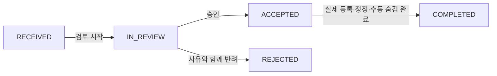

# 2차 확장 사용자 흐름

## 1. 목적과 공통 전제

이 문서는 개인 컬렉션, 인기 맛집, 관리자 큐레이션, 사용자 제보·신고와 서비스 내 알림의 화면 간 흐름과 실패 후 다음 행동을 정의한다. 기능 정책은 각 PRD와 요구사항 원문이 소유하며 API 경로·필드는 후속 명세에서 정한다.

- 개인 컬렉션·제보·신고·알림은 로그인 회원만 사용한다.
- 인기 맛집과 게시된 큐레이션은 비로그인 사용자도 조회한다.
- 큐레이션 편집과 제보·신고 검토는 인증된 관리자만 사용한다.
- 공개 화면은 공개 맛집만 노출한다.
- 인증 만료 시 입력을 가능한 범위에서 보존하고 로그인 후 원래 화면으로 돌아갈 수 있게 한다.

## 2. 개인 컬렉션

### 2.1 생성과 관리

1. 회원이 `COL-LIST`에 진입한다.
2. 시스템은 본인 컬렉션을 최근 수정순으로 표시한다.
3. 회원이 `COL-CREATE`에서 이름을 입력한다.
4. 서버가 이름과 회원당 20개 상한을 검증한다.
5. 성공하면 새 컬렉션을 목록 선두에 표시하고, 실패하면 입력값을 유지한 채 이유를 안내한다.
6. 이름 변경은 성공 시 최근 수정 시각을 갱신한다.
7. 삭제는 확인 대화상자에서 구성 관계 삭제를 알린 뒤 실행한다. 맛집 원본은 변경하지 않는다.

### 2.2 맛집 추가와 제거

1. 회원이 공개 맛집에서 `COL-ADD`를 연다.
2. 자신의 컬렉션 목록에 포함 여부와 추가 가능 상태를 표시한다.
3. 선택한 컬렉션마다 동일 맛집 중복과 100개 상한을 검증한다.
4. 성공한 컬렉션은 즉시 포함 상태로 바뀐다. 실패 시 다른 컬렉션의 기존 결과를 거짓으로 되돌리지 않고 서버 결과를 다시 조회한다.
5. `COL-DETAIL`은 맛집을 최근 추가순으로 표시한다.
6. 제거 확인 후 관계만 삭제한다.

### 2.3 예외

- 다른 회원 자원: 내용을 표시하지 않고 공통 접근 불가 상태로 이동한다.
- 맛집 비공개·삭제: 추가를 막고 기존 컬렉션 상세에서는 숨긴다. 남은 항목이 없으면 빈 상태를 표시한다.
- 상한 도달: 새 생성·추가 제어를 비활성화하고 삭제 후 재시도 방법을 안내한다.
- 인증 만료: 재로그인 뒤 직전 컬렉션 또는 맛집으로 복귀한다.

## 3. 인기 맛집

1. 사용자가 `POPULAR-LIST` 또는 메인 인기 영역에 진입한다.
2. 시스템은 현재 찜 수가 1 이상인 공개 맛집을 찜 수 내림차순, 맛집 ID 오름차순으로 최대 20개 표시한다.
3. 사용자가 카드를 선택하면 기존 맛집 상세로 이동한다.
4. 결과가 없으면 집계 오류가 아닌 정상 빈 상태를 표시한다.
5. 조회 실패 시 마지막 결과를 최신으로 오인하게 표시하지 않고 재시도 제어를 제공한다.

## 4. 관리자 큐레이션

### 4.1 작성과 게시

1. 관리자가 `CUR-ADMIN-LIST`에 진입해 초안을 만든다.
2. `CUR-ADMIN-EDIT`에서 제목·설명과 공개 맛집 최대 20개를 구성하고 수동 순서를 정한다.
3. 저장 검증이 실패하면 편집 내용을 보존하고 항목별 원인을 표시한다.
4. 관리자가 게시를 확정하면 `PUBLISHED`로 전환하고 공개 조회에 즉시 반영한다.
5. 게시 중 수정도 저장 성공 직후 반영한다. 비게시는 확인 후 공개 진입면에서 제거한다.

### 4.2 공개 조회와 자원 상태

1. 사용자는 메인에서 노출 대상으로 선택된 게시 큐레이션 최대 5개를 본다.
2. `CUR-PUBLIC-DETAIL`은 관리자 순서대로 공개 맛집만 표시한다.
3. 구성 맛집이 비공개·삭제되면 공개 화면에서 자동으로 빠지고 관리자 목록·편집 화면에 경고가 표시된다.
4. 모든 구성 맛집이 숨겨진 경우 큐레이션 설명과 빈 상태를 표시할지, 큐레이션 자체를 숨길지는 메인 노출 규칙 승인 시 확정한다.

## 5. 사용자 제보와 신고

### 5.1 접수

1. 회원이 `REQ-TYPE`에서 제보 또는 신고를 선택한다.
2. `REQ-CREATE`에서 대상 유형·대상 또는 후보 정보·설명·선택적 근거 URL을 입력한다.
3. 서버가 악성 입력, URL, 동일 회원·대상·유형의 열린 요청 중복과 Asia/Seoul 기준 합산 하루 5건을 검증한다.
4. 성공하면 `RECEIVED` 상세를 표시한다. 실패하면 안전한 입력은 보존하고 수정 또는 다음 날 재시도 방법을 안내한다.
5. `REQ-MEMBER-LIST`와 `REQ-MEMBER-DETAIL`에서는 본인의 요청만 조회한다.

### 5.2 관리자 검토와 실제 조치

1. 관리자가 `REQ-ADMIN-QUEUE`에서 유형과 상태로 요청을 찾는다.
2. 상세를 확인하고 `IN_REVIEW`로 전환한다.
3. 근거가 부족하거나 유효하지 않으면 회원 표시 사유와 함께 `REJECTED`로 전환한다.
4. 유효하면 `ACCEPTED`로 전환한다. 이 시점에는 원본 데이터가 자동 변경되지 않는다.
5. 관리자가 기존 등록·정정·공개 상태 기능으로 실제 조치를 수행하고 확인한 뒤 `COMPLETED`로 전환한다.
6. 신고 접수만으로 자동 숨김하지 않는다. 긴급 사안은 관리자가 별도 권한으로 수동 숨김한다.

### 5.3 상태 전이 실패

- 허용되지 않은 상태 전이는 거부하고 현재 최신 상태를 다시 표시한다.
- 동시 검토 충돌 시 후행 요청은 실패하고 최신 이력을 다시 불러온다.
- 상태 전이와 알림 생성 중 하나라도 실패하면 둘 다 반영하지 않고 관리자가 재시도한다.

## 6. 사용자 알림

1. 요청이 `IN_REVIEW`, `ACCEPTED`, `REJECTED`, `COMPLETED`로 바뀔 때 같은 DB 트랜잭션에서 회원 알림을 생성한다.
2. 같은 요청·상태 조합이 이미 있으면 중복 생성하지 않는다.
3. 회원은 헤더에서 정확한 미읽음 수를 확인한다. 화면 표시는 100 이상이면 `99+`다.
4. `NOTI-LIST`는 최신순으로 보존 범위 내 알림을 표시한다.
5. 회원이 알림을 선택하면 본인 알림을 읽음 처리하고 관련 요청 상세로 이동한다.
6. 전체 읽음은 현재 회원의 모든 미읽음 알림에 원자적으로 적용한다.

### 6.1 예외와 보존

- 다른 회원 알림: 존재 여부를 드러내지 않고 접근을 차단한다.
- 관련 요청 식별 연결이 제거됐거나 보존 만료된 경우: 알림 본문은 보존 범위에서 표시하되 이동 불가를 안내한다.
- 읽음 처리 실패: 읽지 않음 상태를 유지하고 재시도를 제공한다.
- 외부 푸시 없이 사용자가 서비스에 다시 진입할 때 최신 목록과 미읽음 수를 조회한다.

## 7. 교차 기능 상태 표

| 사건 | 공개 화면 | 회원 화면 | 관리자 화면 | 알림 |
|---|---|---|---|---|
| 맛집 비공개·삭제 | 인기·큐레이션에서 제외 | 컬렉션 구성에서 숨김 | 큐레이션 경고 | 생성하지 않음 |
| 요청 `IN_REVIEW` | 영향 없음 | 상태·사유 확인 | 검토 중 | 1건 생성 |
| 요청 `ACCEPTED` | 자동 데이터 변경 없음 | 승인 확인 | 실제 조치 대기 | 1건 생성 |
| 요청 `REJECTED` | 영향 없음 | 반려 사유 확인 | 종료 | 1건 생성 |
| 요청 `COMPLETED` | 실제 조치 결과에 따름 | 처리 결과 확인 | 종료 | 1건 생성 |
| 회원 탈퇴 | 공개 집계는 익명 결과만 유지 | 개인 자원 접근 종료 | 보존 정책에 따른 식별 제거 | 회원 연결·알림 제거 |

## 8. 흐름 완료 검수

- [ ] 각 흐름에 로딩·빈 상태·권한·인증 만료·동시 변경·서버 오류의 다음 행동이 있다.
- [ ] 제보와 신고의 입력 및 관리자 조치가 섞이지 않는다.
- [ ] `ACCEPTED`와 실제 데이터 반영 완료가 구분된다.
- [ ] 상태 전이와 알림 생성이 부분 성공하지 않는다.
- [ ] 공개 상태 변경이 인기·큐레이션·컬렉션에 같은 의미로 적용된다.
