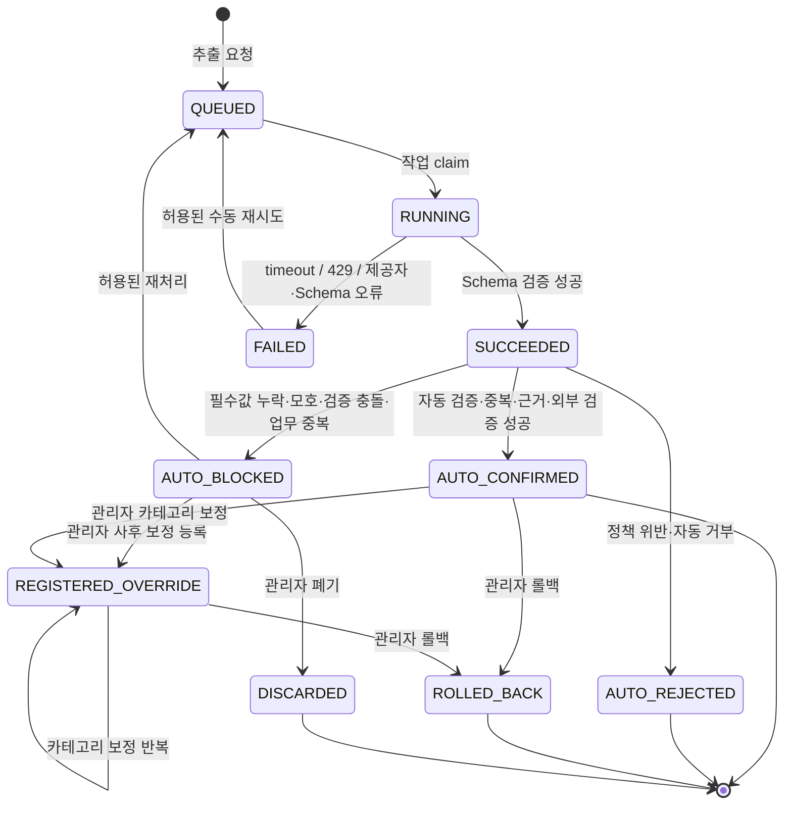

# 3차 확장 사용자 흐름

## 1. 목적과 공통 전제

이 문서는 자연어 맛집 탐색, AI 영상 정보 추출과 맛집 코스 추천의 화면 간 행동·상태 전이·실패 복구를 정의한다. 제품 정책은 각 PRD와 요구사항이 소유하며 API 경로·필드·데이터 구조는 후속 명세에서 정한다.

- 자연어 검색과 코스 추천은 비로그인 사용자도 사용할 수 있다.
- AI 영상 정보 추출 요청·상태 조회·예외 보정·롤백은 인증된 관리자만 사용한다. 정상 등록은 관리자 승인 없이 자동 처리한다.
- 일반 사용자에게 AI 추출 후보·신뢰도·근거 구간을 노출하지 않으며, 관리자 확정 전 태그도 검색 조건으로 노출하지 않는다.
- 자연어·AI·Mobility 장애는 기존 목록·필터·상세와 관리자 수동 등록을 중단시키지 않는다.
- 공개 화면은 공개·활성 맛집만 사용하고 코스는 유효한 좌표가 있는 맛집만 사용한다.

## 2. 자연어 맛집 탐색

### 2.1 정상 검색과 직접 필터 조합

1. 사용자가 `NLS-SEARCH`에서 자연어 문장을 입력한다.
2. 필요하면 서울 자치구·음식 카테고리·유튜버 등 기존 필터와 확정 태그(최대 5개)를 직접 선택한다.
3. 시스템은 문장을 지원 조건으로 해석한다.
4. 같은 조건 종류가 충돌하면 직접 필터를 적용하고 제외된 자연어 조건을 별도 표시한다. 활성 확정 태그가 여러 개면 같은 유효 Visit의 태그를 모두 만족하는 맛집만 반환한다.
5. 서로 다른 조건 종류는 AND로 조합해 기존 공개 맛집 목록을 조회한다.
6. 화면은 적용 조건·제외 조건·미지원 표현과 결과 목록을 분리해 표시한다.
7. 사용자가 직접 필터나 태그 선택을 바꾸고 검색을 다시 실행하면 현재 문장과 새 조건으로 조회한다. 적용 조건 표시는 조회 결과를 설명하는 용도이며 개별 제거 제어를 제공하지 않는다.

### 2.2 빈 결과와 해석 실패

- 유효 조건 + 결과 0건: 적용 조건을 유지한 정상 빈 상태를 보여주고, 문장 수정과 직접 필터·태그 변경으로 조건을 바꾸도록 안내한다. 적용 조건 Badge에 개별 제거 제어는 두지 않는다.
- 지원 조건 0개: 전체 목록을 대신 표시하지 않고 지원하는 예시와 기존 필터 진입을 제공한다.
- 일부 미지원: 적용 가능한 조건과 미지원 표현을 나누고, 사용자가 지원 조건만으로 계속할지 수정할지 선택한다.
- 서버·해석기 오류: 입력과 직접 필터를 유지하고 재시도와 기존 구조화 필터 사용을 제공한다.
- 입력 원문은 저장된 검색 기록이나 운영 로그로 남기지 않는다.

## 3. AI 영상 정보 추출과 자동 등록·예외 보정

> 이 절의 등록 단위 판정 서술과 `MANUAL_OVERRIDE` 세 하위 상태 전이는 `합의 대기` 상태다. 절차와 불발 시 되돌릴 범위는 [ADR-AI-001 1절](../../07-adr/integration/ai-001-video-extraction-candidate-boundary.md)에 있다.

### 3.1 전체 상태 전이

`REGISTERED_OVERRIDE`·`ROLLED_BACK`·`DISCARDED`는 별도 Enum 값이 아니라 `MANUAL_OVERRIDE` 하나의 세 하위 상태다. 저장 계층은 `rolled_back_at`·`discarded_at`으로 구분한다.

| 하위 상태 | 구분 | 등록 결과 | 후속 전이 |
|---|---|---|---|
| 등록 유지 | 두 시각 모두 없음 | 존재 | 카테고리 보정, 롤백 |
| 롤백 완료 | `rolled_back_at` 있음 | 없음 | 없음. 종결 |
| 폐기 완료 | `discarded_at` 있음 | 없음 | 없음. 종결 |

작업 실행 상태와 자동 등록 상태는 분리한다. `SUCCEEDED`는 AI 출력 Schema를 처리했다는 뜻이며, 자동 검증을 통과하면 `AUTO_CONFIRMED`로 전환하면서 정식 Entity와 `VisitTag`를 생성·공개한다. 관리자는 정상 경로의 사전 승인자가 아니며 차단 결과의 보정·롤백만 수행한다.

같은 맛집·방문 관계가 이미 존재하는 업무 중복(`DUPLICATE_CONFLICT`)은 `AUTO_BLOCKED`로 귀결한다. 관리자가 기존 등록 결과를 확인하고 사후 보정할 수 있어야 하기 때문이다. `AUTO_REJECTED`는 입력·정책 검증 실패로 끝난 종결 상태이며 복구 경로가 없다. 이 매핑은 [`BR-AIEXTRACT-011`](../../01-requirements/business-rules.md#br-aiextract-011-등록-단위-일괄-등록과-예외-전환)과 [관리자 AI 영상 추출 API](../../05-specs/api/admin/ai-video-extraction-api.md) 2.1절과 같다.

접수 단계의 중복은 성격이 다르다. 같은 영상·입력·버전 조합의 반복 요청은 상태 전이가 아니라 기존 작업으로 수렴하며 새 작업을 만들지 않는다.

### 3.2 신규 영상 감지와 관리자 추가

#### Webhook 신규 영상

1. 관리자가 Creator 관리 화면에서 특정 YouTube 채널의 신규 영상 감지를 활성화한다.
2. YouTube Webhook이 신규 영상의 채널·영상 식별자를 전달하면 시스템은 수신 시각·중복 키를 검증한다.
3. Webhook 처리기는 외부 AI 호출이나 정식 Entity 저장 없이 `QUEUED` 작업만 등록하고 즉시 응답한다.
4. 관리자는 `AI-EXTRACT-LIST`에서 `WEBHOOK` 유입 경로와 작업 상태를 확인한다.
5. Webhook 누락·구독 장애·입력 부족이면 관리자가 신규 영상 추가 화면에서 URL과 보완 텍스트를 제출해 같은 작업으로 수렴시킨다.

#### 관리자 신규 영상 추가

1. 관리자가 `AI-EXTRACT-CREATE`에서 YouTube URL과 선택적 보완 텍스트를 입력한다.
2. 시스템은 URL·입력·버전 조합을 검증하고 Webhook 또는 기존 관리자 요청과 중복 여부를 확인한다.
3. 초기 데이터 적립은 관리자가 범위를 나누어 제출하며, 신규 Webhook 작업보다 낮은 우선순위로 처리된다.

### 3.3 추출 요청

1. 관리자가 `AI-EXTRACT-CREATE`에서 YouTube URL과 선택적 보완 텍스트를 입력하거나, Webhook 작업의 보완 입력을 연다.
2. 화면은 원본 영상·전체 자막을 저장하지 않는 범위와 외부 제공자 전송 여부를 안내한다.
3. 시스템은 URL 형식·입력 길이·악성 입력과 중복 키를 검증한다.
4. 같은 영상·입력 해시·모델·Prompt·Schema 조합이 있으면 새 작업 대신 `AI-EXTRACT-DETAIL`의 기존 작업으로 이동한다.
5. 새 요청은 `QUEUED`로 접수하고 관리자는 목록으로 돌아가도 된다.

### 3.3 정상 추출과 자동 등록

1. `AI-EXTRACT-LIST`에서 관리자가 작업 상태와 대기·실행 시간을 확인한다.
2. Worker는 `SUCCEEDED` 결과를 장소 단위 등록 단위로 나눈 뒤, 단위마다 필드별 필수값·근거·태그 정규화·중복·Kakao·YouTube·Visit 검증을 자동 실행한다. 장소 동일성은 상호명·주소로 Kakao를 검색해 판정하고, 대표 음식 카테고리는 확정한 장소의 분류와 메뉴 표현으로 결정한다. 관리자에게 후보 선택이나 카테고리 입력을 요구하지 않는다.
3. 모든 검증이 성공한 등록 단위는 `AUTO_CONFIRMED`로 전환하고 Restaurant·Creator·Video·Visit·`AI_AUTO_CONFIRMED VisitTag`를 하나의 원자적 흐름으로 생성·공개한다. 원자성 경계는 등록 단위 하나이며, 한 단위의 실패가 이미 통과한 다른 단위를 되돌리지 않는다.
4. 자동 등록 결과에는 모델·Prompt·Schema 버전과 검증 증거를 연결한다.
5. 관리자는 목록에서 자동 등록 결과와 감사 이력을 조회하고, 오류가 발견된 경우에만 사후 보정 또는 롤백을 요청한다.

### 3.4 부분 추출

부분 추출은 작업 실행 상태 `SUCCEEDED` 안의 결과 완전성 `PARTIAL`로 표현한다.

1. 화면 상단에 “일부 항목을 추출하지 못했습니다” 경고와 누락 개수를 표시한다.
2. 추출된 필드는 근거·신뢰도와 함께 표시하고 누락 필드는 `UNKNOWN`과 누락 이유를 표시한다.
3. 정식 등록 필수값이 부족하면 `AUTO_BLOCKED`로 전환하고 공개하지 않는다.
4. 관리자는 차단 사유를 확인한 뒤 허용된 값만 보완해 재처리하거나, 사후 보정·수동 등록·폐기를 선택한다. 정상 결과를 승인하기 위한 확정 버튼은 제공하지 않는다.
5. 부분 결과를 완전 결과와 같은 성공 지표로 집계하지 않는다.

### 3.5 오류·재시도·복구

- 입력 검증 실패: 제출 전 필드 오류를 표시하고 안전한 입력값을 유지한다.
- Prompt Injection·Schema 이탈: `FAILED`와 안전한 오류 범주만 표시하며 원문·AI 응답 본문을 오류에 노출하지 않는다.
- timeout·429·제공자 장애: 시도 횟수·마지막 실패 시각·재시도 가능 여부를 표시한다.
- quota·비용 상한: 자동·수동 재시도를 막고 기존 수동 등록으로 연결한다.
- Worker 재시작: 미종결 작업을 재claim하거나 실패 종결하고 같은 후보·정식 Entity를 중복 생성하지 않는다.
- 기존 검증 충돌: `AUTO_BLOCKED`를 유지하고 기존 데이터 후보와 불일치 항목을 표시한다. 정식 저장·공개는 0건이어야 한다.

## 4. 맛집 코스 추천

### 4.1 후보 선택과 입력 검증

1. 사용자가 목록·상세에서 “코스에 추가”를 선택한다.
2. `COURSE-BUILDER`는 선택 순서, 공개 상태와 좌표 가능 여부를 표시한다.
3. 1개 이하이면 최소 2개 안내, 5개이면 추가 차단 상태를 표시한다.
4. 첫 맛집은 출발점으로 고정되며 사용자가 순서를 바꿔 첫 항목을 바꾸면 새 첫 항목이 출발점이 된다.
5. 좌표 없음·비공개·삭제 맛집이 있으면 조용히 제외하지 않고 문제 항목을 표시해 교체를 요구한다.

### 4.2 경로 계산과 정상 결과

1. 유효한 2~5개 후보에서 사용자가 계산을 요청한다.
2. 화면은 선택 목록을 유지하고 중복 제출을 막는다.
3. 시스템은 첫 맛집을 고정한 자동차 방문 순서와 실제 구간 경로를 계산한다.
4. 실제 경로 합계가 30km 이하이면 `COURSE-RESULT`에 제안 순서·구간별 거리/시간·전체 거리·생성/만료 시각을 표시한다.
5. 사용자는 맛집 상세로 이동하거나 선택을 수정하거나 새 경로를 조회한다.
6. 만료 뒤 결과를 열면 오래된 거리·시간을 최신으로 표시하지 않고 재조회를 요구한다.

### 4.3 거리 초과와 외부 실패

- 30km 초과: 경로를 결과로 제공하지 않고 어떤 후보를 제거·교체할지 안내한다.
- timeout·429·제공자 장애: 거리·시간을 표시하지 않고 입력 목록·입력 순서·오류 범주만 유지한다.
- 일부 구간 실패: 성공 구간을 합산해 전체 코스로 만들지 않는다.
- quota·비용 차단: 재시도 버튼을 비활성화하고 기존 탐색으로 돌아갈 수 있게 한다.
- 경로 실패는 자연어 검색·기존 목록·상세에 오류 상태를 전파하지 않는다.

## 5. 교차 기능 상태 표

| 사건 | 자연어 탐색 | AI 관리자 화면 | 코스 화면 | 기존 기능 |
|---|---|---|---|---|
| 맛집 비공개·삭제 | 결과에서 제외 | 기존 검증 충돌·예외 보정 | 후보 오류·교체 요구 | 기존 공개 정책 적용 |
| 좌표 없음 | 목록에는 표시 가능 | 주소 후보 자동 차단 | 코스 후보 불가 | 목록·상세 유지 |
| AI 제공자 장애 | 외부 AI 미사용 시 영향 없음 | 작업 실패·수동 등록 | 영향 없음 | 수동 등록·탐색 유지 |
| Mobility 장애 | 영향 없음 | 영향 없음 | 명시적 실패·추정 금지 | 탐색 유지 |
| 비용·quota 상한 | 유료 해석 호출 차단 | 새 호출·재시도 차단 | 새 경로 호출 차단 | 기존 저장 데이터 조회 유지 |
| 자동 검증 전·차단 후보 | 노출 없음 | `AUTO_BLOCKED`·`AUTO_REJECTED` | 노출 없음 | 정식 데이터 무변경 |

## 6. 흐름 완료 검수

- [ ] 자연어 결과 없음과 해석 실패가 구분되고 직접 필터 우선이 보인다.
- [ ] AI 작업 상태와 자동 등록·예외 보정 상태가 섞이지 않는다.
- [ ] AI 정상·부분·실패·중복·검증 충돌·재시도·자동 등록·롤백에 다음 행동이 있다.
- [ ] 부분 추출의 누락 필드와 확정 불가 이유가 필드 단위로 표시된다.
- [ ] 코스 개수·좌표·30km·만료·외부 부분 실패가 추정값 없이 처리된다.
- [ ] 외부 장애와 비용 차단이 기존 탐색·상세·수동 등록에 전파되지 않는다.
