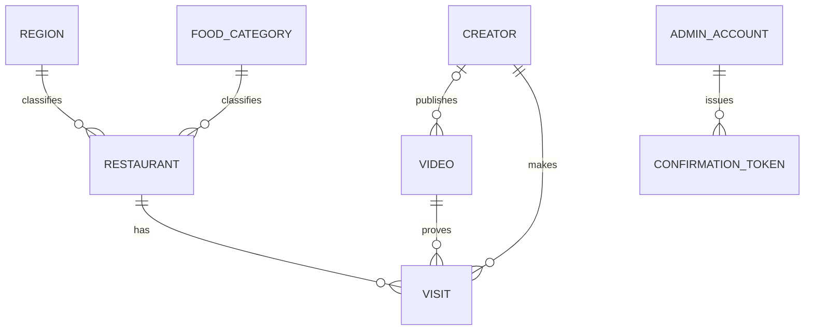

# 맛잇온 물리 데이터 모델

## 1. 목적과 범위

논리 ERD를 PostgreSQL 17.10과 Spring Data JPA로 구현할 수 있는 관계형 스키마로 구체화한다. PostgreSQL 영속 데이터, 제약, 인덱스와 Flyway 순서를 다루며 Redis 8.8의 Refresh Token 값 구조는 범위에서 제외한다.

MVP PostgreSQL 테이블은 `region`, `food_category`, `admin_account`, `restaurant`, `creator`, `video`, `visit`, `confirmation_token` 8개다. `AdminRefreshToken`은 Redis 전용이고 PostgreSQL 테이블을 만들지 않는다.

## 2. 확정 물리 컨벤션

| 항목 | 결정 |
|---|---|
| 스키마 | PostgreSQL 기본 `public` 스키마 |
| 테이블·컬럼 | 영문 소문자 단수형 `snake_case` |
| PK·FK 이름 | `pk_{table}`, `fk_{child}__{parent}` |
| UK·CHECK 이름 | `uk_{table}__{columns}`, `ck_{table}__{rule}` |
| 일반 인덱스 이름 | `ix_{table}__{purpose}` |
| 내부 ID | 애플리케이션에서 생성한 UUID v4, PostgreSQL `uuid`, API에서는 불투명 문자열 |
| 외부 ID | 제공자 원문 식별자를 trim 후 저장하며 대소문자를 임의 변경하지 않음 |
| 시간 | `timestamp(6) with time zone`, UTC 저장·전달 |
| 문자열 | API 최대 길이를 `varchar(n)`으로 반영하고 필수 문자열은 trim 후 빈 값 금지 |
| 상태 | PostgreSQL enum 대신 `varchar`와 명명된 `CHECK` 사용 |
| boolean | `boolean`, 의미가 두 값으로 완결될 때만 사용 |
| JSON | 서버 검증 후보에만 `jsonb`; 핵심 엔티티 속성을 JSON으로 저장하지 않음 |
| 삭제 | 핵심 공개 데이터는 논리 삭제, FK 대상은 물리 삭제하지 않음 |
| FK 삭제 동작 | 기본은 명시적 `ON DELETE RESTRICT`; 회원 FK는 `favorite`·`recent_restaurant_view`·`personal_collection`·`notification`에 `CASCADE`, `submission`·`report`에 `SET NULL`을 적용하며 상세 예외는 §5와 [2차 확장 데이터 계약](second-expansion-data-contract.md)을 따른다. |
| 감사 시각 | `created_at`, `updated_at`; DB 기본값은 `CURRENT_TIMESTAMP`, JPA가 변경 시각 갱신 |

UUID v4는 DB 확장 없이 생성할 수 있고 API의 불투명 문자열 계약을 지킨다. JPA 저장 전에 ID를 부여해 `save()`의 신규/기존 판정과 테스트 픽스처를 명확히 한다. UUID 원문은 로그에 개인정보처럼 취급할 필요는 없지만 외부 제공자 ID와 확인 Token 해시는 공개·관리자 응답과 업무 로그에 노출하지 않는다.

## 3. 외부 동일성 결정

- Restaurant 동일성은 Kakao 장소 검증 응답의 안정된 장소 ID를 `kakao_place_id varchar(64)`로 저장해 전역 유일하게 보장한다.
- 관리자가 입력한 URL에서 ID를 단순 파싱한 값은 신뢰하지 않는다. Kakao 검증 Adapter가 최종 장소 응답에서 얻은 ID만 후보 Snapshot과 Restaurant에 기록한다.
- Kakao가 안정된 장소 ID를 제공하지 못하거나 응답 간 ID가 충돌하면 `REVIEW_REQUIRED`이며 Token과 Restaurant를 만들지 않는다.
- Creator는 YouTube channel ID인 `external_channel_id varchar(64)`, Video는 YouTube video ID인 `external_video_id varchar(32)`를 유일 키로 사용한다.
- URL·이름·주소·채널명·영상 제목은 표시 정보이며 유일 키가 아니다.

이 설계의 논리 검토 항목과 최종 소유 문서는 다음과 같다.

| 검토 ID | 물리 결정 |
|---|---|
| `RV-DATA-001` | [ADR-EXT-001](../../07-adr/integration/ext-001-reference-verification.md)의 제공자 place ID를 `kakao_place_id` 유일 키로 구현 |
| `RV-DATA-002` | [ADR-DATA-008](../../07-adr/data/data-008-publication-lifecycle-soft-delete.md): publication/lifecycle 분리와 논리 삭제 |
| `RV-DATA-003` | [ADR-DATA-007](../../07-adr/data/data-007-uuid-v4-identifiers.md): 애플리케이션 생성 UUID v4 |
| `RV-DATA-004` | 고정 code·UUID를 가진 Flyway 기준 데이터 |
| `RV-DATA-005` | 핵심 테이블은 공통 시각 3종만 저장하고 상태 변경은 운영 감사 로그에 기록; 구조화된 DB 이력은 후속 범위 |
| `RV-DATA-008` | Creator–Video와 Video–Visit 복합 FK로 채널 일치 강제 |

## 4. 공개·삭제·외부 상태

### 4.1 허용값

| 축 | 컬럼 | 값 | 적용 테이블 |
|---|---|---|---|
| 공개 | `publication_status` | `PUBLIC`, `PRIVATE` | `restaurant`, `creator`, `video`, `visit` |
| 생명주기 | `lifecycle_status` | `ACTIVE`, `DELETED` | `restaurant`, `creator`, `video`, `visit` |
| 외부 가용성 | `external_availability_status` | `AVAILABLE`, `UNAVAILABLE` | `creator`, `video` |
| 확인 Token | `status` | `ISSUED`, `CREATED`, `DUPLICATE` | `confirmation_token` |

핵심 데이터 생성값은 `PUBLIC`·`ACTIVE`, Creator와 Video의 외부 생성값은 `AVAILABLE`이다. 삭제는 `lifecycle_status='DELETED'`, `publication_status='PRIVATE'`, `deleted_at IS NOT NULL`을 같은 트랜잭션에서 설정한다. 복구는 반대로 `ACTIVE`, 검증된 공개 상태와 `deleted_at=NULL`을 함께 적용한다. MVP에는 이 전환 API가 없으나 운영 정정과 후속 API가 같은 규칙을 사용한다.

공개 조회의 공통 판정은 다음과 같다.

```sql
publication_status = 'PUBLIC'
AND lifecycle_status = 'ACTIVE'
```

Creator와 Video는 여기에 `external_availability_status='AVAILABLE'`을 추가한다. Visit는 자신과 Restaurant·Creator·Video가 모두 위 조건을 만족할 때만 유효하다. Creator·Video 생성 시 미리보기에서 외부 확인한 시각을 `external_status_checked_at`에 저장한다.

### 4.2 이력 범위

MVP는 상태 변경 이력 테이블, 변경 사유 컬럼과 변경 관리자 FK를 두지 않는다. 핵심 테이블에는 `created_at`, `updated_at`, `deleted_at`만 저장한다. 인증된 운영 명령의 상태 변경은 행위자·대상·이전/이후 상태·사유·traceId를 애플리케이션 운영 감사 로그에 남기며 PostgreSQL 도메인 이력으로 보지 않는다. 관리 API 또는 법적 감사 범위가 도입되어 구조화된 이력 조회·보존이 필요해지면 새 Flyway 마이그레이션으로 확장한다.

## 5. 관계 구현



- `restaurant.region_id`, `restaurant.food_category_id`는 필수 FK다.
- `video.creator_id`는 등록 순서를 허용하기 위해 nullable이다. 값이 있으면 `(creator_id, publisher_external_channel_id)` 복합 FK가 Creator의 채널 ID 일치를 강제한다.
- Visit 생성 전 Video의 `creator_id`가 null이면 같은 트랜잭션에서 검증된 Creator로 연결한다.
- `visit(video_id, creator_id)`는 `video(id, creator_id)`를 참조한다. 따라서 Visit.Creator와 Video.Creator가 DB에서도 같아야 한다.
- Visit는 `(restaurant_id, creator_id, video_id)` 복합 유일이다.
- Restaurant·Creator·Video·Visit 등 핵심 공개 데이터 FK는 `RESTRICT`다. 회원 소유 관계와 2차 확장 FK의 `CASCADE/SET NULL` 예외는 각 생명주기 계약에 명시하며 [2차 확장 데이터 계약](second-expansion-data-contract.md)을 따른다.

## 6. 트랜잭션 규칙

- Restaurant·Creator·Video 확정 등록은 확인 Token 행을 `SELECT ... FOR UPDATE`로 잠근 뒤 Entity 생성과 Token 결과 갱신을 한 트랜잭션에서 수행한다.
- 외부 동일성 INSERT는 해당 유일 키에 한정해 `ON CONFLICT DO NOTHING RETURNING id`를 사용한다.
- Visit 등록은 세 참조 조회, 공개·활성·외부 가용성 확인, 채널 일치 확인, 필요 시 Video.Creator 연결, Visit INSERT를 한 트랜잭션에서 수행한다.
- `updated_at`만 바뀌는 무의미한 쓰기는 하지 않는다.
- 애플리케이션 선조회는 오류 메시지를 위한 것이며 최종 중복 방지는 DB 유일 제약이 담당한다.

## 7. JPA 매핑 경계

- 상태 컬럼은 `@Enumerated(EnumType.STRING)`으로 매핑하며 enum 이름과 DB CHECK 값을 동일하게 유지한다.
- 모든 연관은 기본 `LAZY`다. 엔티티를 API 응답으로 직접 직렬화하지 않는다.
- URL은 MVP에서 `varchar(2048)` 문자열로 저장한다.
- `confirmation_token.candidate_snapshot`은 `jsonb`로 매핑하되 Entity 생성은 자원 종류별 버전 지정 역직렬화기를 통한다.
- `updated_at`은 JPA auditing 또는 공통 리스너 중 한 방식만 사용하고 DB trigger는 만들지 않는다.
- DDL 자동 생성·갱신은 금지하고 운영 및 테스트 기본값을 `ddl-auto=validate`로 둔다.

## 8. 의도적으로 저장하지 않는 값

`remainingVisitedByCount`, `contentStatus`, 페이지 메타데이터, `visitEvidenceConfirmed`, 방문일, 별도 Visit 검증 상태·검증자·검증 시각, 영상 원본, 비밀번호 평문, 확인 Token 원문은 저장하지 않는다.

## 9. 후속 재검토 조건

- Kakao 장소 ID 정책이 변경되거나 기존 장소가 다른 ID로 재발급될 때
- 정정·삭제 API 도입으로 변경자·사유 이력이 필요할 때
- 부분 일치 검색이 실제 실행계획에서 병목이 되어 `pg_trgm` 도입 근거가 생길 때
- UUID 삽입 지역성 또는 인덱스 크기가 측정된 병목이 될 때
- 전국·계층 지역, 다중 카테고리, 한 방문의 복수 근거 영상이 범위에 포함될 때

2차 확장의 추가 테이블·다형 참조·지연 가능 unique·cleanup은 [2차 확장 데이터 계약](second-expansion-data-contract.md)이 이 문서의 물리 컨벤션을 확장한다.
