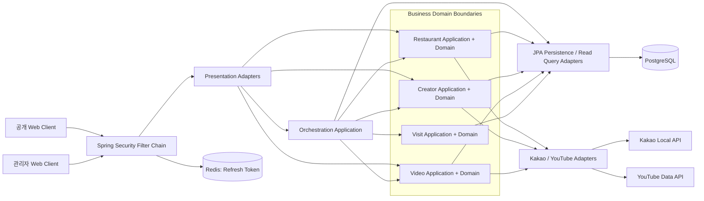

# 상위 컴포넌트 다이어그램

```mermaid
flowchart LR
    PublicClient["공개 Web Client"]
    AdminClient["관리자 Web Client"]
    Security["Spring Security Filter Chain"]
    Presentation["Presentation Adapters"]
    Orchestration["Orchestration Application"]

    subgraph Domains["Business Domain Boundaries"]
        Restaurant["Restaurant Application + Domain"]
        Creator["Creator Application + Domain"]
        Video["Video Application + Domain"]
        Visit["Visit Application + Domain"]
    end

    Persistence["JPA Persistence / Read Query Adapters"]
    External["Kakao / YouTube Adapters"]
    Postgres[("PostgreSQL")]
    Redis[("Redis: Refresh Token")]
    Kakao["Kakao Local API"]
    YouTube["YouTube Data API"]

    PublicClient --> Security
    AdminClient --> Security
    Security --> Presentation
    Presentation --> Orchestration
    Presentation --> Restaurant
    Presentation --> Creator
    Presentation --> Video
    Orchestration --> Restaurant
    Orchestration --> Creator
    Orchestration --> Video
    Orchestration --> Visit
    Orchestration --> Persistence
    Restaurant --> Persistence
    Creator --> Persistence
    Video --> Persistence
    Visit --> Persistence
    Restaurant --> External
    Creator --> External
    Video --> External
    Persistence --> Postgres
    Security --> Redis
    External --> Kakao
    External --> YouTube
```

공개 조회 경로에서는 `External`로 향하는 호출이 없다. 외부 Adapter는 관리자 등록 미리보기에서만 사용한다.
