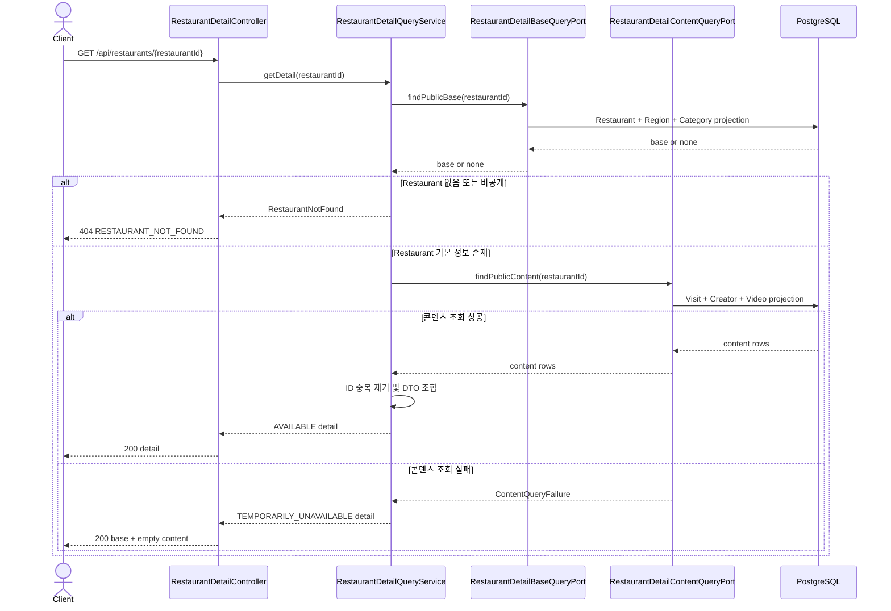

# 맛집 상세 조회 Sequence

```mermaid
sequenceDiagram
    actor Client
    participant Controller as RestaurantDetailController
    participant Query as RestaurantDetailQueryService
    participant BasePort as RestaurantDetailBaseQueryPort
    participant ContentPort as RestaurantDetailContentQueryPort
    participant DB as PostgreSQL

    Client->>Controller: GET /api/restaurants/{restaurantId}
    Controller->>Query: getDetail(restaurantId)
    Query->>BasePort: findPublicBase(restaurantId)
    BasePort->>DB: Restaurant + Region + Category projection
    DB-->>BasePort: base or none
    BasePort-->>Query: base or none

    alt Restaurant 없음 또는 비공개
        Query-->>Controller: RestaurantNotFound
        Controller-->>Client: 404 RESTAURANT_NOT_FOUND
    else Restaurant 기본 정보 존재
        Query->>ContentPort: findPublicContent(restaurantId)
        ContentPort->>DB: Visit + Creator + Video projection
        alt 콘텐츠 조회 성공
            DB-->>ContentPort: content rows
            ContentPort-->>Query: content rows
            Query->>Query: ID 중복 제거 및 DTO 조합
            Query-->>Controller: AVAILABLE detail
            Controller-->>Client: 200 detail
        else 콘텐츠 조회 실패
            ContentPort-->>Query: ContentQueryFailure
            Query-->>Controller: TEMPORARILY_UNAVAILABLE detail
            Controller-->>Client: 200 base + empty content
        end
    end
```

Kakao·YouTube 외부 API는 이 Sequence에 참여하지 않는다.
