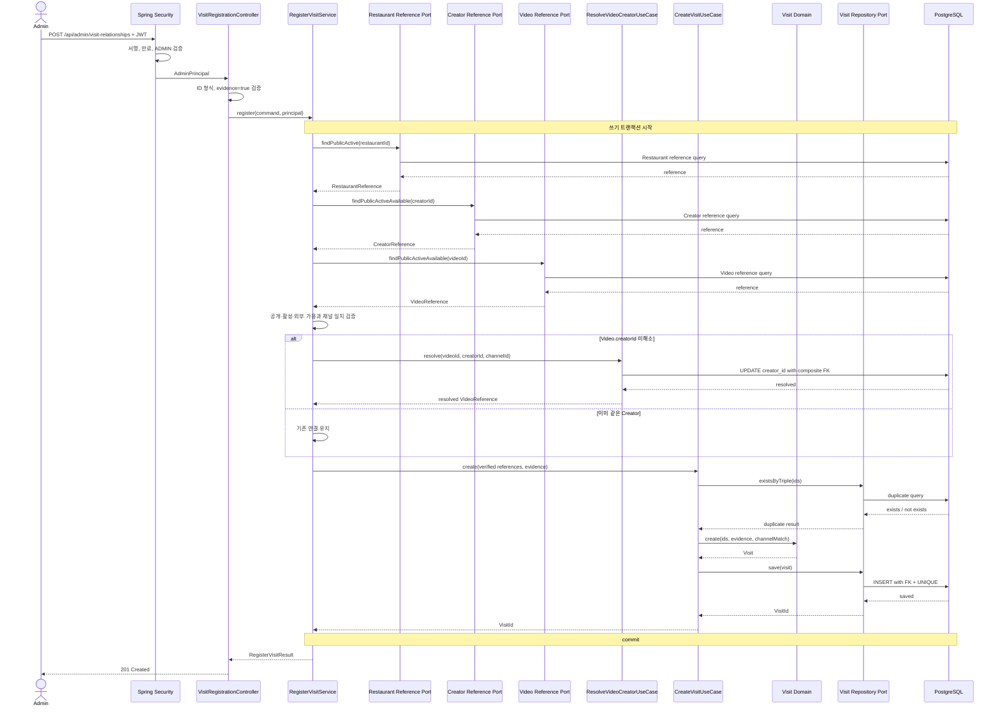

# 방문 관계 등록 Sequence

```mermaid
sequenceDiagram
    actor Admin
    participant Security as Spring Security
    participant Controller as VisitRegistrationController
    participant Service as RegisterVisitService
    participant Restaurant as Restaurant Reference Port
    participant Creator as Creator Reference Port
    participant Video as Video Reference Port
    participant VideoLink as ResolveVideoCreatorUseCase
    participant VisitUseCase as CreateVisitUseCase
    participant Visit as Visit Domain
    participant Repository as Visit Repository Port
    participant DB as PostgreSQL

    Admin->>Security: POST /api/admin/visit-relationships + JWT
    Security->>Security: 서명, 만료, ADMIN 검증
    Security->>Controller: AdminPrincipal
    Controller->>Controller: ID 형식, evidence=true 검증
    Controller->>Service: register(command, principal)
    Note over Service,DB: 쓰기 트랜잭션 시작
    Service->>Restaurant: findPublicActive(restaurantId)
    Restaurant->>DB: Restaurant reference query
    DB-->>Restaurant: reference
    Restaurant-->>Service: RestaurantReference
    Service->>Creator: findPublicActiveAvailable(creatorId)
    Creator->>DB: Creator reference query
    DB-->>Creator: reference
    Creator-->>Service: CreatorReference
    Service->>Video: findPublicActiveAvailable(videoId)
    Video->>DB: Video reference query
    DB-->>Video: reference
    Video-->>Service: VideoReference
    Service->>Service: 공개·활성·외부 가용과 채널 일치 검증
    alt Video.creatorId 미해소
        Service->>VideoLink: resolve(videoId, creatorId, channelId)
        VideoLink->>DB: UPDATE creator_id with composite FK
        DB-->>VideoLink: resolved
        VideoLink-->>Service: resolved VideoReference
    else 이미 같은 Creator
        Service->>Service: 기존 연결 유지
    end
    Service->>VisitUseCase: create(verified references, evidence)
    VisitUseCase->>Repository: existsByTriple(ids)
    Repository->>DB: duplicate query
    DB-->>Repository: exists / not exists
    Repository-->>VisitUseCase: duplicate result
    VisitUseCase->>Visit: create(ids, evidence, channelMatch)
    Visit-->>VisitUseCase: Visit
    VisitUseCase->>Repository: save(visit)
    Repository->>DB: INSERT with FK + UNIQUE
    DB-->>Repository: saved
    Repository-->>VisitUseCase: VisitId
    VisitUseCase-->>Service: VisitId
    Note over Service,DB: commit
    Service-->>Controller: RegisterVisitResult
    Controller-->>Admin: 201 Created
```

어느 검증이나 저장 단계에서 예외가 발생하면 Video.Creator 연결과 Visit 생성을 포함한 트랜잭션 전체를 rollback한다. 채널 불일치는 복합 FK, 동시 Visit 요청은 복합 UNIQUE가 최종 차단한다.
