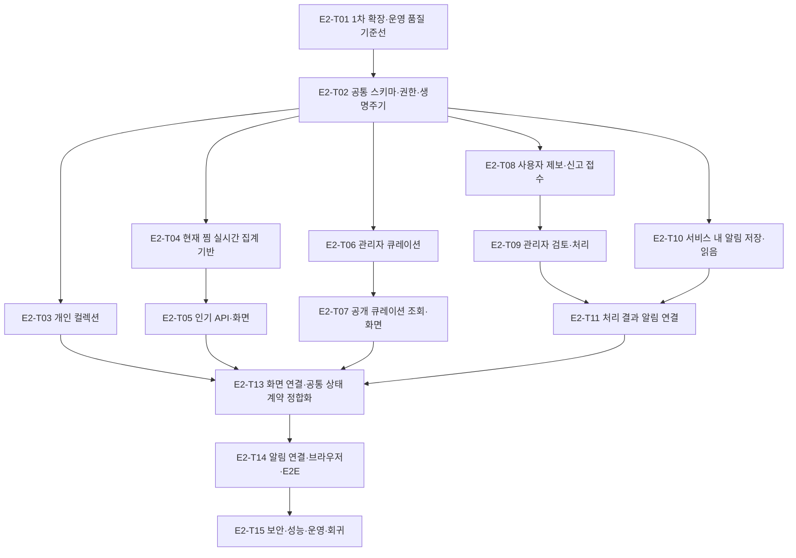

# 맛잇온 2차 확장 구현 계획

## 1. 목적과 계획 확정 조건

이 문서는 확정된 2차 확장 제품·API·데이터·ADR 계약을 구현 순서와 통합 단위로 바꾼다. 실행·PR·완료 기록에는 [최종 Task 분해](expansion-2-task-breakdown.md)의 `E2-T*`를 사용한다.

구현 계획은 제품 의미나 운영 정책을 새로 결정하지 않는다. 컬렉션·인기·큐레이션·제보·신고·서비스 내 알림의 상위 계약이 바뀌면 Scope와 요구사항부터 변경하고 이 계획을 마지막에 갱신한다.

## 2. 구현 원칙

- `E1-T03` 회원 기반, `E1-T04` 회원 인증과 `E1-T05` 찜 데이터가 필요한 경로보다 먼저 완료돼야 한다.
- 기존 Flyway 파일을 수정하지 않고 V3 전진 migration으로 2차 스키마를 추가한다.
- 인기 맛집은 전체 기간의 현재 찜 관계를 요청 시점에 집계한다. 행동 이벤트 수집, Snapshot, Batch, Redis 캐시와 재계산 작업을 만들지 않는다.
- 개인 컬렉션과 관리자 큐레이션은 이름이나 화면이 비슷해도 Aggregate와 생명주기를 공유하지 않는다.
- 제보·신고 접수와 관리자 검토를 먼저 동작시킨 뒤 처리 결과 알림을 같은 DB 트랜잭션에 연결한다.
- 현재 사용자 알림은 서비스 내 알림함뿐이다. 알림 설정·동의·해지, 이메일·웹 푸시·FCM과 외부 전달 재시도는 범위 밖이다.

## 3. 단계와 병렬 흐름

### 3.1 기준선과 공통 기반

`E2-T01`에서 회원·인증·찜, `E1-T11` 지도 조회, `E1-T12` 가입 인증 코드와 [OPS-VALIDATION](../02-analysis/first-expansion-workstreams.md#ops-validation-공통-운영배포-트랙)의 `E1-T13` 검증 참여자 쿠키 세션 정합화, ClassNotFoundException 품질 게이트, CI와 M2 운영 선행 조건을 확인한다. 통과 뒤 `E2-T02`가 V3 스키마, 회원/관리자 접근 경계, 본인 소유 검증, 멱등성과 보존 cleanup 기반을 제공한다.

### 3.2 병렬 기능 경로

`E2-T02` 뒤 다음 경로를 병렬 진행할 수 있다.

- 컬렉션: `E2-T03`
- 인기: `E2-T04 → E2-T05`
- 큐레이션: `E2-T06 → E2-T07`
- 참여: `E2-T08 → E2-T09`
- 서비스 내 알림 기반: `E2-T10`

인기와 큐레이션을 같은 화면에 배치할 때는 카드 필드·로딩·빈 상태·오류 표현을 먼저 합의한다. API, 집계 방식과 저장 모델은 독립적으로 유지한다.

### 3.3 알림과 최종 통합

`E2-T10`은 알림 저장·목록·미읽음 수·읽음·보존을 독립적으로 준비한다. `E2-T11`은 `E2-T09`의 실제 상태 전이가 동작한 뒤 상태·이력·알림을 한 트랜잭션으로 연결한다. 기능 경로를 모두 마치면 `E2-T13` 화면 연결·공통 상태 계약 정합화, `E2-T14` 알림 화면 연결·전체 브라우저 여정·E2E 자동화, `E2-T15` 교차 품질 검증 순서로 종료한다.

## 4. 푸시 Task 제외

`E2-T12`는 생성하지 않는다. FCM은 [ADR-NOTIFY-001](../07-adr/adr-backlog.md#adr-notify-001-fcm-푸시-알림)에서 Post-MVP이며 `NotificationPreference`와 `DeviceToken`도 저장하지 않는다. 향후 외부 푸시 범위를 승인하고 알림 채널·동의·Token·실패·재시도 정책 ADR이 Accepted가 될 때만 `E2-T12`를 새로 생성한다.

## 5. 릴리스 완료 판정

- 21개 2차 확장 FR이 PRD·API·데이터·ADR/보류·WS·`TST-E2-*`·`E2-T*`로 연결된다.
- V2→V3와 빈 DB 전체 migration, 지원 브라우저·360px·접근성, 권한·동시성·보존·성능 검증이 CI에서 통과한다.
- Snapshot·Batch·Redis 인기 캐시, 외부 알림, 컬렉션 공유, 큐레이션 예약·추천·이미지 같은 제외 기능의 구현 흔적이 없다.
- 운영 지표와 복구 절차로 상태 전이·cleanup·공개 조회 실패를 식별할 수 있다.
