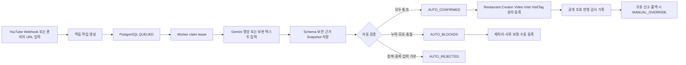
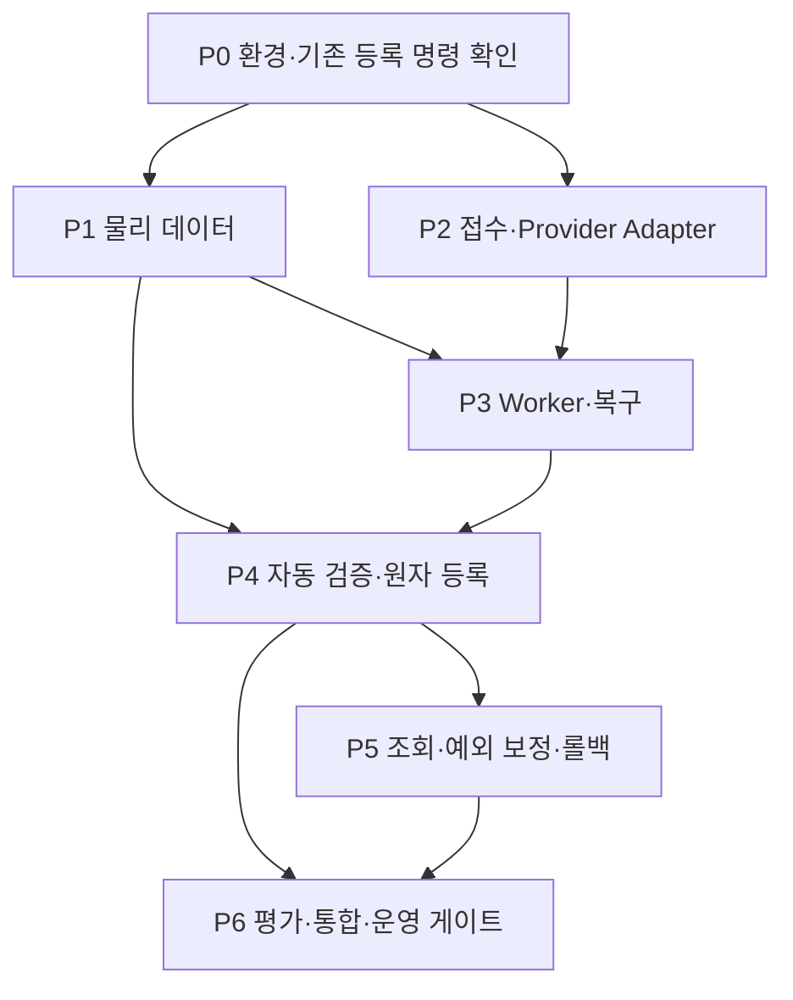

# 맛잇온 3차 확장 구현 계획

## 1. 목적과 구현 경계

이 문서는 승인된 3차 확장 계약을 구현 가능한 순서와 `P0~P6` 세부 체크포인트로 분해한다. 최종 완료 Task는 [E3 Task 분해](third-expansion-task-breakdown.md)의 `E3-T01~T13`이며, 이 문서의 `P*`는 그 Task를 구현·검증하기 위한 내부 실행 단위다. 자연어 검색과 코스 추천도 3차 확장에 포함되지만, 영상에서 생성한 태그가 자연어 검색의 선행 데이터이므로 `WS-15 AI 영상 정보 추출`의 자동 등록 파이프라인을 첫 번째 구현 경로로 둔다.

정상 경로에는 관리자 사전 승인 단계가 없다. Worker가 자동 검증을 모두 통과한 결과를 `AUTO_CONFIRMED`로 전환하면서 기존 등록 명령을 호출하고 Restaurant·Creator·Video·Visit·`VisitTag`를 원자적으로 생성·공개한다. 관리자는 `AUTO_BLOCKED`·`AUTO_REJECTED` 예외 보정, 사후 롤백과 운영 설정만 담당한다.

이 문서는 API·데이터·ADR의 논리 계약을 구현 순서로 정리할 뿐, 승인된 계약을 넓히지 않는다. 최종 SQL·클래스·URL 구현은 각 계약 문서와 기존 패키지·트랜잭션 규칙을 따른다.

## 2. 구현 원칙

1. **작업 접수와 외부 호출을 분리한다.** 관리자 요청과 YouTube Webhook은 작업만 생성하고 Gemini 호출은 애플리케이션 내부 Worker가 수행한다.
2. **자동 검증 전 정식 데이터를 만들지 않는다.** Schema·필수값·근거·중복·Kakao·YouTube·Visit 검증 중 하나라도 실패하면 정식 Entity와 공개 `VisitTag`는 0건이다.
3. **자동 검증 통과 결과는 즉시 등록한다.** `AUTO_CONFIRMED` 전환과 정식 등록·공개 결과를 하나의 애플리케이션 흐름으로 묶고 관리자 확인을 기다리지 않는다.
4. **정식 등록은 원자적이어야 한다.** 기존 등록 명령 또는 orchestration의 외부 호출 결과를 먼저 확정하고, Entity 저장 트랜잭션 안에서 중복·참조·공개 상태를 함께 검증한다.
5. **태그는 생성 가능하지만 무제한 자유 텍스트가 아니다.** AI가 새 태그 후보를 만들 수 있으나 허용 타입, 정규화, 동의어, 중복, 금지 표현, 자막 근거를 통과한 경우에만 `TagDefinition`과 `VisitTag`로 반영한다.
6. **실패는 기존 탐색과 격리한다.** Gemini·Webhook·Worker 장애는 기존 공개 목록·상세·수동 등록을 중단시키지 않는다.
7. **모든 자동 판단을 재현한다.** 모델·Prompt·Schema·입력 hash·근거 위치·검증 결과·사후 보정 이력을 연결한다.
8. **무료 한도를 넘지 않는다.** Gemini Free Tier quota 확인 실패·소진·결제 연결 요구 시 새 호출과 자동 재시도를 차단한다.

## 3. 전체 실행 흐름

실행 상태와 자동 등록 상태를 분리한다.

| 구분 | 상태 | 의미 |
|---|---|---|
| 실행 | `QUEUED` | 작업이 접수되어 Worker를 기다림 |
| 실행 | `RUNNING` | Worker가 lease를 보유하고 외부 호출 또는 검증을 수행함 |
| 실행 | `SUCCEEDED` | AI 출력과 Snapshot 저장이 성공함 |
| 실행 | `FAILED` | timeout·quota·Schema·제공자 오류로 작업을 종료함 |
| 결과 | `AUTO_CONFIRMED` | 자동 검증과 정식 등록·공개가 성공함 |
| 결과 | `AUTO_BLOCKED` | 필수값·근거·외부 검증·중복 판단이 불충분해 공개를 차단함 |
| 결과 | `AUTO_REJECTED` | 정책 위반·악성 입력·허용하지 않은 결과로 자동 거부함 |
| 결과 | `MANUAL_OVERRIDE` | 관리자의 사후 보정·폐기·롤백이 적용됨 |

## 4. 단계별 구현 순서

아래 `P0~P6`은 PR 또는 이슈의 최종 Task ID가 아니다. 각 체크포인트가 어느 `E3-T*` 완료 Task에 귀속되는지는 [E3 Task 분해](third-expansion-task-breakdown.md)를 따른다.

### 4.1. P0 계약·환경 선행 확인

| 체크포인트 | 내용 | 담당 | 선행 | 완료 조건 |
|---|---|---|---|---|
| `P0-01` | API Key가 코드·로그에 노출되지 않는 환경 변수/Secret 경계 확인 | 김인안 | 없음 | 로컬·테스트·운영 설정에서 비밀값 비노출 확인 |
| `P0-02` | Gemini `gemini-3.5-flash-lite` 영상 입력·구조화 출력·Free Tier 호출 확인 | 김인안 | `P0-01` | 공개 YouTube URL과 보완 텍스트 정상·실패 Fixture가 준비됨 |
| `P0-03` | 기존 Restaurant·Creator·Video·Visit 등록 명령의 원자성·멱등성 확인 | 박진영 | 없음 | 자동 등록 orchestration이 호출할 Port와 실패 시 0건 저장 증거 확정 |
| `P0-04` | Webhook 검증 Token·구독 채널·중복 식별자 계약 확정 | 이우람 | 없음 | 잘못된 채널·반복 알림·대형 Payload 테스트 입력 확정 |

P0에서 운영 billing이나 유료 tier를 활성화하지 않는다. Free Tier 제공 여부·quota·결제 연결 요구가 확인되지 않으면 해당 호출은 차단 상태로 둔다.

### 4.2. P1 물리 데이터와 마이그레이션

| 체크포인트 | 내용 | 담당 | 선행 | 완료 조건 |
|---|---|---|---|---|
| `P1-01` | `ai_extraction_job`·lease·멱등성 키·상태 제약 구현 | 김인안 | `P0-03` | 동일 key 동시 요청이 하나의 Job으로 수렴하고 상태 전이가 제한됨 |
| `P1-02` | Snapshot·Attempt·임시 입력·태그 판단 이력 테이블 구현 | 박진영 | `P1-01` | 버전·근거·오류·보존·append-only 제약이 PostgreSQL 테스트를 통과함 |
| `P1-03` | `TagDefinition`·`VisitTag` 자동 생성 경로와 seed 18종 마이그레이션 연결 | 박진영 | `P1-02` | 새 태그 타입은 생성되지 않고 허용 타입 안에서만 자동 등록됨 |
| `P1-04` | 데이터 추적표·Flyway 순서·rollback/재실행 증거 갱신 | 박진영 | `P1-02` | 적용된 기존 migration은 수정하지 않고 새 migration으로 검증됨 |

물리 테이블 이름·컬럼 타입·인덱스는 [AI 영상 데이터 계약](../05-specs/data/third-expansion-ai-video-data-contract.md)과 기존 [테이블 정의](../05-specs/data/table-definitions.md)의 규칙을 함께 적용한다.

### 4.3. P2 작업 접수와 Provider Adapter

| 체크포인트 | 내용 | 담당 | 선행 | 완료 조건 |
|---|---|---|---|---|
| `P2-01` | 관리자 신규 영상 추가 API와 Webhook 수신 API 구현 | 김인안 | `P1-01`, `P0-04` | `202` 작업 접수, traceId, 입력 검증, 중복 응답 계약 통과 |
| `P2-02` | YouTube 채널 감시·구독 갱신·Webhook 검증 Adapter 구현 | 이우람 | `P0-04` | 활성 채널만 접수하고 Webhook에서 AI·정식 등록을 호출하지 않음 |
| `P2-03` | Gemini Provider Port/Adapter와 구조화 응답 변환 구현 | 김인안 | `P0-02` | HTTP·SDK 세부 의존성이 Application 밖에 있고 오류가 정규화됨 |
| `P2-04` | 현재 Prompt `P2`·Schema `S1`·모델 설정 버전 저장과 기존 `P1` 이력 보존 구현 | 김인안 | `P2-03` | 모든 Snapshot과 Attempt가 생성 당시 버전 조합을 재현함 |

Webhook 수신기는 빠르게 작업만 확정한다. 외부 AI 호출과 정식 Entity 저장은 Webhook HTTP 요청 안에서 수행하지 않는다.

### 4.4. P3 Worker·재시도·복구

| 체크포인트 | 내용 | 담당 | 선행 | 완료 조건 |
|---|---|---|---|---|
| `P3-01` | PostgreSQL claim/lease/heartbeat/polling Worker 구현 | 이우람 | `P1-01` | 인스턴스당 Worker 1개, polling 5초, lease 120초, heartbeat 30초 동작 |
| `P3-02` | Gemini timeout·429·5xx·Schema 오류 분류와 재시도 구현 | 이우람 | `P2-03`, `P3-01` | 최대 2회 재시도, 5초·30초 backoff, 정책·입력 오류 즉시 실패 |
| `P3-03` | Worker 재기동·lease 만료·동시 claim 복구 구현 | 이우람 | `P3-01` | 작업 유실·중복 실행·중복 정식 등록이 재현되지 않음 |
| `P3-04` | Free Tier quota 80% 경보·100% hard stop과 BACKFILL 우선순위 구현 | 이우람 | `P3-02` | quota 차단 시 새 외부 호출이 0건이고 기존 탐색은 정상 동작 |

AI 호출 자체는 외부 호출 트랜잭션과 분리한다. Attempt를 먼저 저장하고 호출한 뒤 결과 Snapshot을 저장하며, 작업 재시도는 동일 멱등성 키와 버전 조합을 재사용한다.

### 4.5. P4 자동 검증과 원자적 등록

| 검증 순서 | 검증 내용 | 실패 상태 | 정식 저장 |
|---:|---|---|---:|
| 1 | 출력 Schema·허용 Enum·필수 필드·입력 크기·Prompt Injection 방어 | `FAILED` 또는 `AUTO_REJECTED` | 0건 |
| 2 | 방문 근거 `TIMESTAMP`/`TEXT_RANGE`, `UNKNOWN`·모호 장소 차단 | `AUTO_BLOCKED` | 0건 |
| 3 | Kakao 장소 동일성·주소·좌표·지점 중복 | `AUTO_BLOCKED` | 0건 |
| 4 | YouTube 채널·영상 메타데이터·Creator 연결 | `AUTO_BLOCKED` | 0건 |
| 5 | Visit 중복·Restaurant/Creator/Video 참조·공개 상태 | `AUTO_BLOCKED` | 0건 |
| 6 | 태그 정규화·동의어·금지 표현·근거·중복 | 태그만 차단하거나 전체 `AUTO_BLOCKED` | 허용 태그만 반영 |
| 7 | 모든 검증 통과 후 등록 명령 원자성 | `AUTO_CONFIRMED` 또는 저장 실패 | 성공 시 전체 생성, 실패 시 0건 |

| 체크포인트 | 내용 | 담당 | 선행 | 완료 조건 |
|---|---|---|---|---|
| `P4-01` | 필드·장소·방문 근거 자동 검증 서비스 구현 | 김인안 | `P2-04`, `P3-03` | 모호·근거 없음·동명 장소가 자동 차단됨 |
| `P4-02` | Kakao·YouTube·Visit 검증 Port 조합 구현 | 김인안 | `P0-03`, `P4-01` | 외부 검증 실패 시 정식 Entity 부분 저장 0건 |
| `P4-03` | 태그 생성·정규화·중복·금지 표현·근거 검증 구현 | 김인안 | `P1-03`, `P4-01` | AI 새 태그가 허용 타입·근거·정책을 통과할 때만 활성화됨 |
| `P4-04` | `AUTO_CONFIRMED` 정식 등록 orchestration과 rollback metadata 구현 | 김인안 | `P4-02`, `P4-03` | Restaurant·Creator·Video·Visit·VisitTag 원자성·멱등성 통과 |

정식 등록은 Entity를 API 응답에 직접 노출하지 않고 기존 Application Port를 통해 수행한다. 외부 HTTP 호출 중 DB 트랜잭션을 열지 않으며, 등록 트랜잭션 실패 시 `AUTO_CONFIRMED`로 남기지 않는다.

### 4.6. P5 조회·관리자 예외 보정·롤백

| 체크포인트 | 내용 | 담당 | 선행 | 완료 조건 |
|---|---|---|---|---|
| `P5-01` | 작업 목록·상세·Snapshot·자동 등록 결과 조회 API 구현 | 김인안 | `P4-04` | 입력 원문·비밀정보 없이 상태·근거·버전·오류를 조회함 |
| `P5-02` | `AUTO_BLOCKED` 재처리·수동 보정·폐기 API 구현 | 김인안 | `P5-01` | 정상 결과 승인 버튼 없이 예외만 보정할 수 있음 |
| `P5-03` | `AUTO_CONFIRMED` 오류 신고·비공개·롤백 API 구현 | 김인안 | `P4-04`, `P5-01` | 물리 삭제 없이 공개 상태·관계·감사 이력을 안전하게 변경함 |
| `P5-04` | 관리자 작업 목록·자동 결과·예외 보정 화면 구현 | 김인안 | `P5-01`, `P5-02` | 정상·부분·실패·차단·롤백 화면과 다음 행동이 일치함 |

관리자 화면의 `review` 명칭은 호환성을 위해 API에 남을 수 있지만 의미는 사전 승인(review before publish)이 아니라 사후 보정과 롤백이다.

### 4.7. P6 품질·통합·운영 게이트

| 체크포인트 | 내용 | 담당 | 선행 | 완료 조건 |
|---|---|---|---|---|
| `P6-01` | AI 120건 Dataset·정답·분할·자동 평가 실행 | 박진영 | `P4-01`, `P4-03` | Development 72·Calibration 24·Release holdout 24 결과와 오류 유형이 보존됨 |
| `P6-02` | 자동 확정·차단 표본의 인간 사후 판정 | 박진영 | `P6-01` | 잘못된 장소 연결·근거 없는 태그·누락의 Critical 판정이 종결됨 |
| `P6-03` | 모델·Prompt·Schema 출시·롤백 게이트 연결 | 박진영 | `P6-01`, `P6-02` | 목표 미달·Critical 실패·비용 초과 시 자동 활성화가 차단됨 |
| `P6-04` | API·Repository·Worker·외부 Adapter 통합 테스트 | 박진영 | `P5-04` | 정상·예외·경계·동시성·부분 저장 0건 시나리오 통과 |
| `P6-05` | 단일 EC2 Worker 자원·backlog·복구·비용 측정 | 이우람 | `P3-04`, `P6-04` | CPU·메모리·DB·처리시간·quota·재기동 증거가 기록됨 |
| `P6-06` | 2차 정상 50명·20 RPS와 최대 200명·80 RPS 승계 부하 측정 | 이우람 | `P6-04` | 두 부하 시나리오 결과와 3차 최종 완료 판정이 기록됨 |

## 5. 병렬화와 의존성

- `P1-01~04`은 Flyway 순서와 데이터 소유권이 겹치므로 박진영이 최종 병합한다.
- `P2-01~04`와 `P3-01~04`은 P1 Job 계약이 확정된 뒤 병렬 진행할 수 있다.
- `P4-01~04`은 자동 등록의 핵심 경로이므로 같은 변경 단위에서 API·데이터·트랜잭션 계약을 함께 검토한다.
- `WS-14 자연어 검색`은 `P4-03`의 태그 조회 계약이 안정화된 뒤 확정 태그 검색을 연결한다.
- `WS-16 코스 추천`은 AI 등록 경로와 독립적으로 진행할 수 있으나 좌표 보강률과 Kakao Mobility quota 게이트를 공유한다.
- 공통 Spring Boot·Docker·Flyway 변경은 [소유권](../03-team/ownership.md)의 최종 병합 규칙을 따른다.

## 6. 테스트 매트릭스와 필수 증거

세 Workstream과 품질 트랙의 전체 검증 ID·요구사항·Task 연결은 [3차 확장 테스트 추적표](third-expansion-test-matrix.md)를 기준으로 한다. 이 문서의 아래 표는 AI 자동 등록 경로의 상세 시나리오를 보완한다.

| 영역 | 필수 시나리오 | 증거 |
|---|---|---|
| 접수 | 신규 URL, Webhook, 관리자·Webhook 중복, 잘못된 Token, 대형 Payload | MockMvc·Webhook 계약 테스트 |
| Provider | 정상 영상, 접근 불가, timeout, 429, 5xx, Schema 이탈, 악성 입력 | WireMock/Provider Fake와 오류 분류 결과 |
| Worker | claim 경쟁, lease 만료, 재기동, 재시도 상한, BACKFILL 우선순위 | PostgreSQL 통합 테스트와 Worker 로그 집계 |
| 자동 검증 | 필수값 누락, 동명 장소, 주소 충돌, 방문 근거 없음, Visit 중복 | 자동 차단 상태와 정식 Entity 0건 증거 |
| 자동 등록 | 신규 장소·기존 장소·신규 태그·기존 태그·동시 등록 | 원자성·유일 제약·`AUTO_CONFIRMED` 결과 |
| 예외 보정 | 보완 재처리, 폐기, 사후 태그 통합, 공개 결과 롤백 | `MANUAL_OVERRIDE` append-only 이력 |
| 보안·개인정보 | Prompt Injection, 로그 원문·비밀정보, 임시 입력 삭제 | 로그 검사·보존 삭제 테스트 |
| 비용·운영 | Free Tier 80/100% 경계, quota 차단, Worker 장애, 기존 탐색 격리 | 호출 0건·기능 회귀·자원 측정 결과 |
| 품질 | Dataset 분할·정답 충돌·Critical 오연결·태그 근거 | 평가 보고서와 Release holdout 결과 |

단위 테스트는 외부 저장소 없이, Repository·제약·트랜잭션은 PostgreSQL Testcontainers, Controller는 MockMvc, 외부 Adapter는 WireMock으로 검증한다. 실제 Kakao·YouTube·Gemini 운영 호출은 자동화 테스트에서 사용하지 않는다.

## 7. 완료 게이트

다음 조건을 모두 충족하기 전에는 3차 확장 AI 자동 등록을 운영 활성화하지 않는다.

- [ ] `E3-T01~T13`의 완료 증거가 [3차 확장 테스트 추적표](third-expansion-test-matrix.md)와 [E3 Task 분해](third-expansion-task-breakdown.md)에 연결된다.
- [ ] 자동 검증 전 정식 Entity·공개 `VisitTag` 저장 0건과 자동 검증 통과 후 원자적 등록을 검증한다.
- [ ] 관리자 사전 승인 없이 `AUTO_CONFIRMED` 결과가 등록·공개되고, 차단·폐기·롤백은 `MANUAL_OVERRIDE`로 감사된다.
- [ ] 같은 영상·입력 hash·버전의 중복 작업·중복 Entity·중복 Tag가 0건이다.
- [ ] `UNKNOWN` 근거·모호 장소·금지 표현 태그가 공개 검색에 반영되지 않는다.
- [ ] Prompt Injection·Schema 이탈·원문/비밀정보 로그 노출·임시 입력 보존 위반이 0건이다.
- [ ] Free Tier quota hard stop과 유료 fallback 차단이 검증된다.
- [ ] AI·Worker 장애가 기존 맛집 탐색·상세·수동 등록을 격리한다.
- [ ] 평가 목표와 Critical 오류 0건, 모델·Prompt·Schema 롤백 절차가 통과한다.
- [ ] 단일 EC2 자원·복구·backlog 증거와 2차 정상 50명·20 RPS, 최대 200명·80 RPS 승계 측정 결과가 기록된다.

## 8. 구현 후 문서 갱신

구현 중 계약이 달라지면 코드를 먼저 맞추고 문서를 나중에 정리하지 않는다. 다음 파일을 같은 변경 단위에서 갱신한다.

- API 변경: [AI 영상 추출 API](../05-specs/api/admin/ai-video-extraction-api.md), [API 추적표](../05-specs/api-traceability.md)
- 데이터 변경: [AI 영상 데이터 계약](../05-specs/data/third-expansion-ai-video-data-contract.md), [데이터 추적표](../05-specs/data/data-traceability.md), 후속 Flyway 계획
- 정책 변경: [요구사항](../01-requirements/functional-requirements.md), [비즈니스 규칙](../01-requirements/business-rules.md), 관련 ADR
- 품질 변경: [평가 주도 개발 전략](third-expansion-evaluation-strategy.md)과 평가 결과 보고서
- 운영 변경: Workstream 소유권, 로그·보존·quota·장애 대응 Runbook

이 계획의 완료는 코드 완성을 의미하지 않는다. 모든 완료 게이트의 실행 증거와 기존 공개 탐색 회귀 결과가 있어야 3차 확장 최종 완료로 판정한다.
